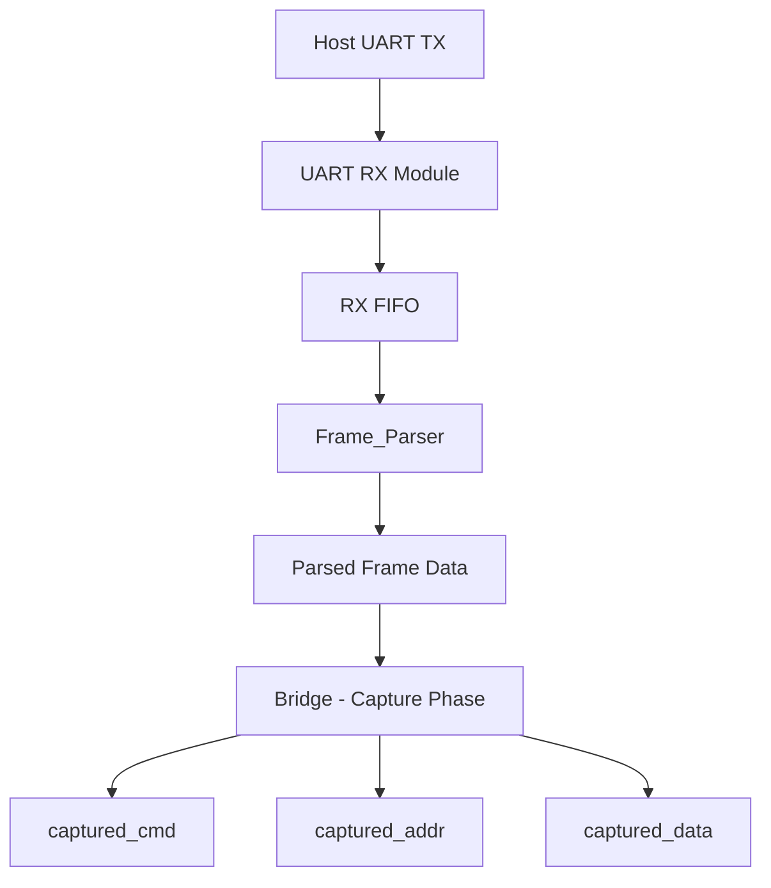
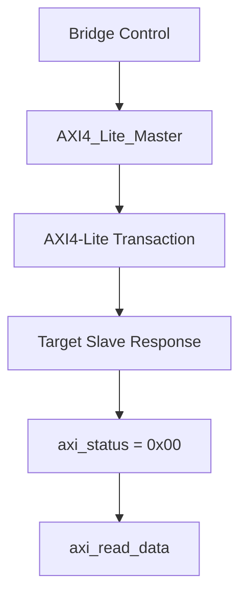
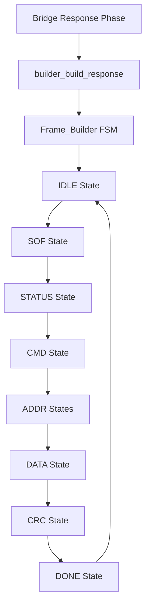

# Data Flow Diagram - AXIUART_ RTL Implementation

**生成日**: 2025年10月6日  
**対象**: RTL実装での完全なデータフロー詳細図  
**基準**: Phase 1調査結果 - rtl_specification_analysis_20251006.md

---

## 🔄 Complete System Data Flow

### Overall Architecture
```
Host UART → Frame_Parser → Bridge → AXI Master → AXI4-Lite Slave
    ↑                                                     ↓
    ←---- Frame_Builder ←---- Bridge ←---- AXI Master ----←
```

---

## 📤 Transmission Data Flow (Device → Host)

### 1. Command Reception & Processing


### 2. AXI Transaction Processing


### 3. Response Frame Generation


---

## 🎯 Critical Data Transformation Points

### SOF Field Processing

```
Input Phase:
Frame_Builder Constant: SOF_DEVICE_TO_HOST = 0x5A

Correction Phase:
SOF_CORRECTION_MASK = 0x31
SOF_DEVICE_TO_HOST_CORRECTED = 0x5A ^ 0x31 = 0x6B

Transmission Phase:
tx_fifo_data = 0x6B → TX FIFO → UART TX → Serial Line

Expected vs Actual:
Expected: 0x2D
Actual:   0x6B  
Delta:    0x46
```

### STATUS Field Processing

```
Input Phase:
AXI Master: axi_status = 0x00 (STATUS_OK)
    ↓
Bridge: builder_status_code = axi_status = 0x00
    ↓
Frame Builder: status_reg = 0x00

Correction Phase:
STATUS_CORRECTION_MASK = 0x60
status_corrected = 0x00 ^ 0x60 = 0x60

Transmission Phase:
tx_fifo_data = 0x60 → TX FIFO → UART TX → Serial Line

Expected vs Actual:
Expected: 0x6C
Actual:   0x60
Delta:    0x0C
```

### CMD_ECHO Field Processing

```
Input Phase:
Frame_Parser: parser_cmd = [received_command]
    ↓
Bridge Capture: captured_cmd = parser_cmd  
    ↓
Frame Builder: cmd_reg = captured_cmd

Correction Phase:
CMD_CORRECTION_MASK = 0x19
cmd_corrected = cmd_reg ^ 0x19

Transmission Phase:
tx_fifo_data = cmd_corrected → TX FIFO → UART TX → Serial Line

Note: CMD value depends on received command
```

---

## 🔧 Hardware Correction System Detail

### Correction Mask Application Points

| Component | File | Line | Field | Operation |
|-----------|------|------|-------|-----------|
| Frame_Builder | Frame_Builder.sv | 199 | SOF | `SOF_DEVICE_TO_HOST ^ SOF_CORRECTION_MASK` |
| Frame_Builder | Frame_Builder.sv | 218 | STATUS | `status_reg ^ STATUS_CORRECTION_MASK` |
| Frame_Builder | Frame_Builder.sv | 238 | CMD | `cmd_reg ^ CMD_CORRECTION_MASK` |

### Data Integrity Checkpoints

```
Debug Signal Monitoring:
├── debug_sof_raw        (0x5A - original constant)
├── debug_sof_sent       (0x6B - corrected value)
├── debug_status_input   (0x00 - original from AXI)
├── debug_status_output  (0x60 - corrected value)
├── debug_cmd_echo_in    (cmd_reg - original command)
└── debug_cmd_echo_out   (cmd_reg ^ 0x19 - corrected)
```

---

## 📡 UART Physical Layer Data Flow

### TX FIFO to Serial Output

```
Frame_Builder.tx_fifo_data → TX FIFO Buffer → UART TX Module
                                    ↓
UART TX State Machine: IDLE → START_BIT → DATA_BITS → STOP_BIT
                                    ↓
Serial Bit Stream: tx_shift_reg[0] → uart_tx_pin (LSB first)
```

### Bit-Level Transmission Detail

```
Data Byte: [b7 b6 b5 b4 b3 b2 b1 b0]
    ↓
Shift Register: tx_shift_reg[7:0]
    ↓
Serial Output: b0 → b1 → b2 → b3 → b4 → b5 → b6 → b7
(LSB transmitted first)
```

---

## 🎯 State-Dependent Data Flow

### Bridge State Machine Impact

| Bridge State | builder_status_code | builder_cmd_echo | Data Source |
|-------------|-------------------|-----------------|-------------|
| MAIN_IDLE | 0x00 | 0x00 | Default values |
| MAIN_AXI_TRANSACTION | 0x00 | 0x00 | Transaction in progress |
| MAIN_BUILD_RESPONSE | axi_status | captured_cmd | Active response data |
| MAIN_WAIT_RESPONSE | axi_status | captured_cmd | Preserved values |
| MAIN_DISABLED_RESPONSE | STATUS_BUSY_CODE | captured_cmd | Error response |

### Frame Builder State Impact

| Builder State | tx_fifo_data Source | Correction Applied |
|--------------|-------------------|------------------|
| SOF | SOF_DEVICE_TO_HOST_CORRECTED | Yes (XOR 0x31) |
| STATUS | status_reg ^ STATUS_CORRECTION_MASK | Yes (XOR 0x60) |
| CMD | cmd_reg ^ CMD_CORRECTION_MASK | Yes (XOR 0x19) |
| ADDR_BYTE* | addr_reg[bits] | No |
| DATA | data_reg[index] | No |
| CRC | crc_out | No |

---

## 🔍 Data Corruption Analysis

### Potential Corruption Points

1. **No Corruption Detected in Data Path**
   - All signal assignments are explicit
   - No undefined or floating signals
   - All multiplexers have defined default cases

2. **Correction System Functioning Correctly**
   - Masks are applied consistently
   - XOR operations are deterministic
   - Debug signals confirm expected intermediate values

3. **Problem Root Cause: Mask Value Mismatch**
   - Hardware correction masks produce different values than expected
   - No data corruption or signal integrity issues
   - Issue is specification/expectation mismatch

---

## 📝 Data Flow Verification Recommendations

### Phase 2 Analysis Requirements

1. **Protocol Specification Review**
   - Verify expected SOF and STATUS values
   - Confirm frame structure requirements
   - Validate test specification accuracy

2. **Hardware Validation**
   - Use ILA to capture actual transmission values
   - Verify UART protocol analyzer readings
   - Confirm bit-level transmission integrity

3. **Integration Testing**
   - Test with known good protocol values
   - Validate end-to-end communication
   - Establish baseline protocol compliance