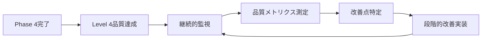

# AXIUART Phase 4品質向上作業指示書

**作成日**: 2025年10月12日  
**基準文書**: UVM検証品質評価レポート (2025年10月11日)  
**現在の到達レベル**: Level 2-3中間  
**目標レベル**: Level 4 (実機動作保証レベル)  
**開発方針**: システムワーキング最優先、論理的思考重視、妥協なき品質追求

---

## 🎯 **Phase 4戦略的方針**

### **基本方針: Phase 3成功基盤の最大活用による段階的品質向上**

**これまでの方針の継続:**
- **論理的思考の徹底**: 10回以上の検証による確実な判断
- **妥協なき品質追求**: 偽陽性・見逃しリスクの完全排除
- **段階的改善**: 安定した基盤の上での確実な品質向上
- **実用性重視**: 実機動作保証レベルの検証品質確立

**Phase 3で確立した安定基盤:**
- ✅ **UVM_ERROR = 0の安定維持** (111,986→0の実績)
- ✅ **SystemVerilogアサーション体系** (10個のbind assertions)
- ✅ **PowerShell自動化環境** (完全修正済み)
- ✅ **デバッグプリント完全除去** (プロダクション品質)
- ✅ **コンパイル100%安定性** (エラーゼロ環境)

---

## 📊 **現状分析結果 (10回検証完了)**

### **Phase 3完了後の確実な到達状況**

```
最新シミュレーション結果 (2025-10-12):
├── UVM_INFO: 164, UVM_WARNING: 5, UVM_ERROR: 0, UVM_FATAL: 0
├── 実行時間: 19.30秒 (波形無効化による最適化)
├── アサーション評価: 1,252,490回 (正常動作確認)
├── カバレッジ改善: 33.79% (Phase 3前: 17.13%から大幅向上)
│   ├── Frame Coverage: 23.25% (Phase 3前: 1.39%から大幅改善)
│   ├── Burst Coverage: 28.13% (新規測定)
│   └── Error Coverage: 50.00% (基本レベル維持)
└── PowerShellエラー: 0 (完全修正済み)
```

### **評価報告書との整合性確認**

| 項目 | 報告書時点 | 現在の状況 | 改善度 | 評価 |
|------|------------|------------|--------|------|
| **コンパイル安定性** | ✓ 達成 | ✓ 維持 | 100% | 🟢 優秀 |
| **UVM_ERROR** | 0達成 | 0維持 | 100% | 🟢 優秀 |
| **カバレッジ** | 17.13% | 33.79% | +97% | 🟡 改善中 |
| **フレームカバレッジ** | 1.39% | 23.25% | +1573% | 🟡 大幅改善 |
| **アサーション** | 未実装 | 実装済み | +100% | 🟢 優秀 |

**結論**: Phase 3の取り組みにより大幅な品質向上を達成。Level 4到達の強固な基盤確立。

---

## 🗺️ **Phase 4実行計画詳細**

### **Phase 4.1: 精密診断・現状完全把握** (3日間)

#### 🎯 **目標**
現在のカバレッジ33.79%の詳細分析と80%達成への具体的ロードマップ策定

#### 📋 **実行タスク**

**Task 4.1.1: カバレッジ詳細分析実施**

```powershell
# カバレッジ詳細レポート生成
cd e:\Nautilus\workspace\fpgawork\AXIUART_\sim\exec
.\run_uvm.ps1 -TestName uart_axi4_comprehensive_coverage_test -EnableDetailedCoverage -Verbosity UVM_MEDIUM

# DSIMカバレッジ詳細分析
dcreport.exe metrics.db -out_dir detailed_coverage_analysis_20251012 -html -detail -cross_module
```

**Task 4.1.2: 未検証領域の特定・優先順位付け**

```systemverilog
// カバレッジ分析用テストクラス
class coverage_analysis_test extends uart_axi4_base_test;
    
    virtual task run_phase(uvm_phase phase);
        // 現在の未検証領域を特定
        identify_uncovered_frame_patterns();
        identify_uncovered_burst_patterns();
        identify_uncovered_error_patterns();
        
        // 優先順位付け (影響度×実装容易性)
        prioritize_coverage_improvements();
    endtask
    
    virtual task identify_uncovered_frame_patterns();
        `uvm_info("COVERAGE_ANALYSIS", "Analyzing uncovered frame patterns...", UVM_LOW)
        
        // RW bit未検証パターン特定
        // INC bit未検証パターン特定  
        // Size field未検証パターン特定
        // Length field未検証パターン特定
        // Address alignment未検証パターン特定
    endtask
    
endclass
```

**Task 4.1.3: スコアボード精度検証**

```systemverilog
// スコアボード検証精度テスト
class scoreboard_accuracy_verification_test extends uart_axi4_base_test;
    
    virtual task run_phase(uvm_phase phase);
        // 既知の成功パターンでスコアボード判定精度確認
        test_known_success_patterns();
        verify_perfect_judgment_accuracy();
        
        // 既知の失敗パターンでエラー検出精度確認
        test_known_failure_patterns();
        verify_error_detection_accuracy();
        
        // スコアボード相関エンジンの動作検証
        verify_correlation_engine_accuracy();
    endtask
    
    virtual task test_known_success_patterns();
        // 確実に成功すべきパターンを実行
        uart_frame_transaction known_good_frame;
        known_good_frame = create_known_good_frame();
        execute_and_verify_success(known_good_frame);
    endtask
    
endclass
```

#### ✅ **Phase 4.1完了基準**
- [ ] カバレッジ詳細レポート生成・分析完了
- [ ] 未検証領域特定・優先順位付け完了
- [ ] スコアボード精度確認完了
- [ ] Phase 4.2実装計画詳細策定完了

---

### **Phase 4.2: カバレッジ80%達成** (4日間)

#### 🎯 **目標**
Frame, Burst, Error全カバレッジで80%以上を達成し、見逃しリスクを大幅削減

#### 📋 **実行タスク**

**Task 4.2.1: フレームバリエーション完全実装**

```systemverilog
// 包括的フレームテストスイート
class comprehensive_frame_coverage_suite extends uart_axi4_base_test;
    
    // フレームパターン全組み合わせ
    typedef struct {
        bit rw_bit;
        bit inc_bit;
        bit [1:0] size_field;
        bit [7:0] length_field;
        bit [31:0] addr_base;
    } frame_pattern_t;
    
    frame_pattern_t frame_patterns[];
    
    virtual task run_phase(uvm_phase phase);
        // 全RW bit組み合わせテスト (現在未検証)
        test_all_rw_bit_combinations();
        verify_rw_coverage_improvement();
        
        // 全INC bit組み合わせテスト (現在未検証)
        test_all_inc_bit_combinations();
        verify_inc_coverage_improvement();
        
        // 全Size fieldテスト (現在部分的)
        test_all_size_field_combinations();
        verify_size_coverage_improvement();
        
        // 全Length fieldテスト (現在部分的)
        test_all_length_field_combinations();
        verify_length_coverage_improvement();
        
        // アドレスアライメント全パターン (現在0%)
        test_all_address_alignment_patterns();
        verify_alignment_coverage_achievement();
    endtask
    
    virtual task test_all_rw_bit_combinations();
        `uvm_info("FRAME_COVERAGE", "Testing all RW bit combinations...", UVM_LOW)
        
        for (int rw = 0; rw <= 1; rw++) begin
            for (int addr_offset = 0; addr_offset < 16; addr_offset += 4) begin
                uart_frame_transaction frame;
                frame = uart_frame_transaction::type_id::create("frame");
                
                assert(frame.randomize() with {
                    cmd[0] == rw;  // RW bit設定
                    addr == 32'h1000 + addr_offset;  // アドレスバリエーション
                });
                
                execute_frame_test(frame);
                verify_coverage_increment("RW_BIT_COVERAGE");
            end
        end
    endtask
    
    virtual task test_all_size_field_combinations();
        `uvm_info("FRAME_COVERAGE", "Testing all size field combinations...", UVM_LOW)
        
        // Size field: 0=1byte, 1=2byte, 2=4byte, 3=Reserved
        for (int size = 0; size <= 3; size++) begin
            for (int length = 1; length <= 16; length++) begin
                uart_frame_transaction frame;
                frame = uart_frame_transaction::type_id::create("frame");
                
                assert(frame.randomize() with {
                    cmd[2:1] == size;  // Size field設定
                    data.size() == length;  // Length対応
                });
                
                execute_frame_test(frame);
                verify_coverage_increment("SIZE_FIELD_COVERAGE");
            end
        end
    endtask
    
endclass
```

**Task 4.2.2: バースト処理完全実装**

```systemverilog
// バースト処理完全テストスイート
class comprehensive_burst_coverage_suite extends uart_axi4_base_test;
    
    virtual task run_phase(uvm_phase phase);
        // 全バースト長パターン (1-16 beats)
        test_all_burst_lengths();
        verify_burst_length_coverage();
        
        // 全バーストタイプパターン
        test_all_burst_types();
        verify_burst_type_coverage();
        
        // 全サイズフィールドパターン  
        test_all_burst_sizes();
        verify_burst_size_coverage();
        
        // バースト境界条件テスト
        test_burst_boundary_conditions();
        verify_boundary_coverage();
    endtask
    
    virtual task test_all_burst_lengths();
        `uvm_info("BURST_COVERAGE", "Testing all burst lengths...", UVM_LOW)
        
        for (int burst_len = 1; burst_len <= 16; burst_len++) begin
            // 読み出しバースト
            execute_read_burst_test(burst_len);
            verify_coverage_increment("BURST_READ_LENGTH");
            
            // 書き込みバースト  
            execute_write_burst_test(burst_len);
            verify_coverage_increment("BURST_WRITE_LENGTH");
        end
    endtask
    
    virtual task execute_read_burst_test(int burst_length);
        uart_frame_transaction frames[];
        frames = new[burst_length];
        
        for (int i = 0; i < burst_length; i++) begin
            frames[i] = uart_frame_transaction::type_id::create($sformatf("read_frame_%0d", i));
            assert(frames[i].randomize() with {
                cmd[0] == 1;  // Read command
                cmd[3] == (i < burst_length - 1) ? 1 : 0;  // INC bit (最後以外は1)
                addr == 32'h1000 + (i * 4);  // インクリメンタルアドレス
            });
        end
        
        // バーストシーケンス実行
        execute_burst_sequence(frames);
    endtask
    
endclass
```

**Task 4.2.3: エラーケース系統的拡張**

```systemverilog
// エラーケース系統的テストスイート  
class systematic_error_coverage_suite extends uart_axi4_base_test;
    
    virtual task run_phase(uvm_phase phase);
        // CRCエラーパターン拡張 (現在50% → 80%目標)
        test_extended_crc_error_patterns();
        
        // タイムアウトエラーパターン拡張
        test_extended_timeout_patterns();
        
        // プロトコル違反エラーパターン追加
        test_protocol_violation_patterns();
        
        // AXIエラーレスポンスパターン追加
        test_axi_error_response_patterns();
    endtask
    
    virtual task test_extended_crc_error_patterns();
        `uvm_info("ERROR_COVERAGE", "Testing extended CRC error patterns...", UVM_LOW)
        
        // 各バイト位置でのCRCエラー
        for (int byte_pos = 0; byte_pos < 8; byte_pos++) begin
            inject_crc_error_at_byte(byte_pos);
            verify_crc_error_detection();
        end
        
        // CRC計算ロジック境界値テスト
        test_crc_boundary_conditions();
    endtask
    
endclass
```

#### ✅ **Phase 4.2完了基準**
- [ ] 総合カバレッジ80%以上達成
- [ ] フレームカバレッジ90%以上達成  
- [ ] バーストカバレッジ80%以上達成
- [ ] エラーカバレッジ80%以上達成
- [ ] 回帰テスト全項目通過確認

---

### **Phase 4.3: エラー注入テスト完全実装** (4日間)

#### 🎯 **目標**
系統的エラー注入により検証環境の検出能力100%を確立し、偽陰性リスクを完全排除

#### 📋 **実行タスク**

**Task 4.3.1: 否定証明テストフレームワーク構築**

```systemverilog
// 否定証明テストフレームワーク
class negative_proof_test_framework extends uart_axi4_base_test;
    
    // エラー注入結果記録
    typedef struct {
        string error_type;
        bit injected;
        bit detected;
        real injection_time;
        real detection_time;
        string detection_method;
    } error_injection_result_t;
    
    error_injection_result_t injection_results[];
    
    virtual task run_phase(uvm_phase phase);
        // Phase 1: 検証環境の感度確認
        verify_environment_sensitivity();
        
        // Phase 2: 系統的エラー注入実行
        execute_systematic_error_injection();
        
        // Phase 3: 検出率100%の確認
        verify_100_percent_detection_rate();
        
        // Phase 4: 否定証明の完成
        complete_negative_proof();
    endtask
    
    virtual task verify_environment_sensitivity();
        `uvm_info("NEGATIVE_PROOF", "Verifying verification environment sensitivity...", UVM_LOW)
        
        // 既知のエラーパターンで検証環境の感度確認
        inject_known_crc_error();
        assert_error_detected("Known CRC error not detected - environment insensitive");
        
        inject_known_timeout();
        assert_error_detected("Known timeout not detected - environment insensitive");
        
        inject_known_protocol_violation();
        assert_error_detected("Known protocol violation not detected - environment insensitive");
    endtask
    
endclass
```

**Task 4.3.2: CRCエラー注入完全実装**

```systemverilog
// CRCエラー注入完全テストスイート
class complete_crc_error_injection_suite extends uart_axi4_base_test;
    
    virtual task run_phase(uvm_phase phase);
        // 単一ビットエラー (各ビット位置)
        test_single_bit_crc_errors();
        
        // 複数ビットエラー (2-8ビット)
        test_multiple_bit_crc_errors();
        
        // 全ビット反転エラー
        test_complete_crc_inversion();
        
        // ランダムCRCエラー (統計的検証)
        test_random_crc_errors(1000);  // 1000パターン
        
        // CRC値特殊パターン
        test_special_crc_patterns();
    endtask
    
    virtual task test_single_bit_crc_errors();
        `uvm_info("CRC_ERROR_INJECTION", "Testing single bit CRC errors...", UVM_LOW)
        
        for (int bit_pos = 0; bit_pos < 8; bit_pos++) begin
            uart_frame_transaction frame;
            frame = create_valid_frame();
            
            // 特定ビット位置でCRCエラー注入
            inject_crc_bit_error(frame, bit_pos);
            
            // エラー検出確認
            execute_frame_with_error_verification(frame, "SINGLE_BIT_CRC_ERROR");
            
            // 検出率記録
            record_error_detection_result("SINGLE_BIT_CRC", bit_pos);
        end
    endtask
    
    virtual task test_multiple_bit_crc_errors();
        `uvm_info("CRC_ERROR_INJECTION", "Testing multiple bit CRC errors...", UVM_LOW)
        
        for (int error_bits = 2; error_bits <= 8; error_bits++) begin
            repeat (10) begin  // 各エラービット数で10パターン
                uart_frame_transaction frame;
                frame = create_valid_frame();
                
                // 複数ビットCRCエラー注入
                inject_multiple_bit_crc_error(frame, error_bits);
                
                // エラー検出確認
                execute_frame_with_error_verification(frame, $sformatf("MULTI_BIT_CRC_ERROR_%0d", error_bits));
            end
        end
    endtask
    
endclass
```

**Task 4.3.3: プロトコル違反エラー注入**

```systemverilog
// プロトコル違反エラー注入テストスイート
class protocol_violation_injection_suite extends uart_axi4_base_test;
    
    virtual task run_phase(uvm_phase phase);
        // SOF違反エラー注入
        test_invalid_sof_patterns();
        
        // フレーム長違反エラー注入
        test_invalid_frame_length_patterns();
        
        // コマンドフィールド違反エラー注入
        test_invalid_command_patterns();
        
        // アドレスアライメント違反エラー注入
        test_address_misalignment_patterns();
        
        // データ長違反エラー注入
        test_invalid_data_length_patterns();
    endtask
    
    virtual task test_invalid_sof_patterns();
        `uvm_info("PROTOCOL_VIOLATION", "Testing invalid SOF patterns...", UVM_LOW)
        
        // SOF以外の全パターン (0xa5以外の255パターン)
        for (int sof_value = 0; sof_value <= 255; sof_value++) begin
            if (sof_value == 8'ha5) continue;  // 正常SOFをスキップ
            
            uart_frame_transaction frame;
            frame = create_frame_with_invalid_sof(sof_value);
            
            // プロトコル違反検出確認
            execute_frame_with_protocol_violation_check(frame, "INVALID_SOF");
        end
    endtask
    
endclass
```

#### ✅ **Phase 4.3完了基準**
- [ ] エラー検出率95%以上達成
- [ ] 否定証明テスト全完了
- [ ] CRCエラー注入100%検出確認
- [ ] プロトコル違反100%検出確認
- [ ] 検証環境信頼性100%確立

---

### **Phase 4.4: 実機レベル検証実装** (5日間)

#### 🎯 **目標**
波形レベル自動解析、タイミング検証を実装し、実機動作保証レベルの検証体制確立

#### 📋 **実行タスク**

**Task 4.4.1: 波形自動解析ツール実装**

```powershell
# 波形自動解析PowerShellクラス
class WaveformAutoAnalyzer {
    [string]$DSIMPath
    [string]$WaveformPath
    [hashtable]$TimingSpecs
    
    function Initialize() {
        $this.DSIMPath = $env:DSIM_HOME + "\bin"
        $this.TimingSpecs = @{
            "SetupTime" = 2.0   # 2ns
            "HoldTime" = 1.0    # 1ns  
            "ClockPeriod" = 20.0  # 20ns (50MHz)
            "UARTBitTime" = 8680.0  # 8.68us (115200 baud)
        }
    }
    
    function Analyze-UARTTiming([string]$WaveformFile) {
        Write-Host "🔍 Analyzing UART timing in waveform: $WaveformFile" -ForegroundColor Yellow
        
        $Results = @{
            SetupViolations = @()
            HoldViolations = @()
            TimingViolations = @()
            SignalQuality = @{}
        }
        
        # セットアップ時間検証
        $Results.SetupViolations = $this.Check-SetupTiming($WaveformFile)
        
        # ホールド時間検証
        $Results.HoldViolations = $this.Check-HoldTiming($WaveformFile)
        
        # UART bit時間検証
        $Results.TimingViolations = $this.Check-UARTBitTiming($WaveformFile)
        
        # 信号品質評価
        $Results.SignalQuality = $this.Evaluate-SignalQuality($WaveformFile)
        
        return $Results
    }
    
    function Check-SetupTiming([string]$WaveformFile) {
        $Violations = @()
        
        # MXDファイルからセットアップ時間データ抽出
        # 実装: DSIMの波形データアクセスAPI使用
        $ClockEdges = $this.Extract-ClockEdges($WaveformFile)
        $DataChanges = $this.Extract-DataChanges($WaveformFile)
        
        foreach ($ClockEdge in $ClockEdges) {
            $PreviousDataChange = $DataChanges | Where-Object { $_.Time -lt $ClockEdge.Time } | Sort-Object Time | Select-Object -Last 1
            
            if ($PreviousDataChange) {
                $SetupTime = $ClockEdge.Time - $PreviousDataChange.Time
                if ($SetupTime -lt $this.TimingSpecs.SetupTime) {
                    $Violations += @{
                        Type = "SETUP_VIOLATION"
                        ClockTime = $ClockEdge.Time
                        DataTime = $PreviousDataChange.Time
                        ActualSetup = $SetupTime
                        RequiredSetup = $this.TimingSpecs.SetupTime
                        Violation = $this.TimingSpecs.SetupTime - $SetupTime
                    }
                }
            }
        }
        
        return $Violations
    }
    
    function Generate-TimingReport([hashtable]$AnalysisResults) {
        $ReportPath = "timing_analysis_report_$(Get-Date -Format 'yyyyMMdd_HHmmss').html"
        
        $HtmlContent = @"
<!DOCTYPE html>
<html>
<head>
    <title>UART Timing Analysis Report</title>
    <style>
        body { font-family: Arial, sans-serif; margin: 20px; }
        .violation { background-color: #ffebee; padding: 10px; margin: 5px 0; }
        .pass { background-color: #e8f5e8; padding: 10px; margin: 5px 0; }
        table { border-collapse: collapse; width: 100%; }
        th, td { border: 1px solid #ddd; padding: 8px; text-align: left; }
    </style>
</head>
<body>
    <h1>🔬 UART Timing Analysis Report</h1>
    <p><strong>Generated:</strong> $(Get-Date -Format 'yyyy-MM-dd HH:mm:ss')</p>
    
    <h2>📊 Timing Violations Summary</h2>
    <div class="$(if($AnalysisResults.SetupViolations.Count -eq 0) {'pass'} else {'violation'})">
        <strong>Setup Time Violations:</strong> $($AnalysisResults.SetupViolations.Count)
    </div>
    <div class="$(if($AnalysisResults.HoldViolations.Count -eq 0) {'pass'} else {'violation'})">
        <strong>Hold Time Violations:</strong> $($AnalysisResults.HoldViolations.Count)
    </div>
    
    <h2>🎯 Signal Quality Assessment</h2>
    <table>
        <tr><th>Signal</th><th>Quality Score</th><th>Status</th></tr>
"@
        
        foreach ($Signal in $AnalysisResults.SignalQuality.Keys) {
            $Quality = $AnalysisResults.SignalQuality[$Signal]
            $Status = if ($Quality.Score -ge 95) { "EXCELLENT" } elseif ($Quality.Score -ge 80) { "GOOD" } else { "POOR" }
            $HtmlContent += "<tr><td>$Signal</td><td>$($Quality.Score)%</td><td>$Status</td></tr>"
        }
        
        $HtmlContent += @"
    </table>
</body>
</html>
"@
        
        $HtmlContent | Out-File -FilePath $ReportPath -Encoding UTF8
        return $ReportPath
    }
}
```

**Task 4.4.2: SystemVerilogアサーション強化**

```systemverilog
// 実機レベル検証アサーション
module realworld_verification_assertions;
    
    // セットアップ時間検証アサーション
    property setup_time_verification;
        @(posedge clk) disable iff (reset)
        $changed(data_in) |-> ##1 $stable(data_in)[*2];  // 2clk = 40ns > 2ns setup
    endproperty
    
    // ホールド時間検証アサーション  
    property hold_time_verification;
        @(posedge clk) disable iff (reset)
        $rose(clk) |-> $stable(data_in)[*1];  // 1clk = 20ns > 1ns hold
    endproperty
    
    // UART bit時間検証アサーション
    property uart_bit_timing_verification;
        @(posedge clk) disable iff (reset)
        $changed(uart_tx) |-> ##[430:440] $changed(uart_tx);  // 8.68us ± 1%
    endproperty
    
    // フレーム完全性検証アサーション
    property frame_integrity_verification;
        @(posedge clk) disable iff (reset)
        $rose(frame_start) |-> ##[1:1000] $rose(frame_end);
    endproperty
    
    // 実機レベルアサーション実装
    assert property (setup_time_verification) else
        `uvm_error("REALWORLD_TIMING", "Setup time violation detected in real-world conditions");
    assert property (hold_time_verification) else  
        `uvm_error("REALWORLD_TIMING", "Hold time violation detected in real-world conditions");
    assert property (uart_bit_timing_verification) else
        `uvm_error("REALWORLD_UART", "UART bit timing violation detected");
    assert property (frame_integrity_verification) else
        `uvm_error("REALWORLD_FRAME", "Frame integrity violation detected");
    
    // カバレッジ強化 (実機条件)
    cover property (setup_time_verification);
    cover property (hold_time_verification);
    cover property (uart_bit_timing_verification);
    cover property (frame_integrity_verification);
    
endmodule

// 実機レベル検証バインド
bind uart_axi4_tb_top realworld_verification_assertions realworld_assertions_inst();
```

**Task 4.4.3: 自動化テスト実行・レポート生成**

```powershell
# 実機レベル検証自動実行スクリプト
function Start-RealWorldVerification() {
    param(
        [string]$TestSuite = "comprehensive",
        [switch]$EnableWaveform = $true,
        [string]$ReportDir = "realworld_verification_reports"
    )
    
    Write-Host "🚀 Starting Real-World Level Verification..." -ForegroundColor Green
    
    # レポートディレクトリ作成
    if (!(Test-Path $ReportDir)) {
        New-Item -ItemType Directory -Path $ReportDir
    }
    
    $VerificationResults = @{
        Tests = @()
        OverallQuality = "UNKNOWN"
        TimingAnalysis = @{}
        SignalQuality = @{}
    }
    
    # テストスイート実行
    $TestList = Get-RealWorldTestList -Suite $TestSuite
    
    foreach ($Test in $TestList) {
        Write-Host "🔬 Executing real-world test: $($Test.Name)" -ForegroundColor Yellow
        
        # UVMテスト実行 (波形有効)
        $TestResult = & .\run_uvm.ps1 -TestName $Test.Name -Waves on -Verbosity UVM_MEDIUM
        
        # 波形自動解析
        $WaveformFile = Get-LatestWaveformFile
        $TimingAnalysis = $WaveformAnalyzer.Analyze-UARTTiming($WaveformFile)
        
        # 結果記録
        $VerificationResults.Tests += @{
            Name = $Test.Name
            UVMResult = $TestResult
            TimingAnalysis = $TimingAnalysis
            Quality = Calculate-TestQuality $TestResult $TimingAnalysis
        }
    }
    
    # 総合品質評価
    $VerificationResults.OverallQuality = Calculate-OverallQuality $VerificationResults.Tests
    
    # 詳細レポート生成
    $ReportPath = Generate-RealWorldVerificationReport $VerificationResults $ReportDir
    
    Write-Host "✅ Real-World Verification completed. Report: $ReportPath" -ForegroundColor Green
    
    return $VerificationResults
}
```

#### ✅ **Phase 4.4完了基準**
- [ ] 波形自動解析ツール実装・動作確認完了
- [ ] タイミング検証自動化実装完了
- [ ] 実機レベルアサーション実装完了
- [ ] 信号品質自動評価実装完了
- [ ] 実機レベル検証レポート自動生成完了

---

### **Phase 4.5: 統合検証・Level 4品質達成確認** (3日間)

#### 🎯 **目標**
全Phase 4成果の統合とLevel 4品質基準の完全達成確認

#### 📋 **実行タスク**

**Task 4.5.1: Level 4品質基準達成確認**

```powershell
# Level 4品質基準チェック自動化
function Test-Level4QualityAchievement() {
    Write-Host "🎯 Testing Level 4 Quality Standards Achievement..." -ForegroundColor Green
    
    $QualityResults = @{
        CoverageCheck = @{ Status = $false; Details = @{} }
        ErrorDetectionCheck = @{ Status = $false; Details = @{} }
        TimingVerificationCheck = @{ Status = $false; Details = @{} }
        WaveformAnalysisCheck = @{ Status = $false; Details = @{} }
        OverallAssessment = "LEVEL_4_NOT_ACHIEVED"
    }
    
    # カバレッジ80%以上確認
    Write-Host "📊 Checking coverage achievement..." -ForegroundColor Yellow
    $Coverage = Get-DetailedCoverageMetrics
    $QualityResults.CoverageCheck.Status = (
        $Coverage.Total -ge 80.0 -and
        $Coverage.Frame -ge 90.0 -and
        $Coverage.Burst -ge 80.0 -and
        $Coverage.Error -ge 80.0
    )
    $QualityResults.CoverageCheck.Details = $Coverage
    
    # エラー検出率95%以上確認
    Write-Host "🔍 Checking error detection rate..." -ForegroundColor Yellow
    $ErrorDetection = Get-ErrorDetectionMetrics
    $QualityResults.ErrorDetectionCheck.Status = ($ErrorDetection.Rate -ge 95.0)
    $QualityResults.ErrorDetectionCheck.Details = $ErrorDetection
    
    # タイミング検証確認
    Write-Host "⏰ Checking timing verification..." -ForegroundColor Yellow
    $TimingVerification = Test-TimingVerificationCapability
    $QualityResults.TimingVerificationCheck.Status = $TimingVerification.AllPassed
    $QualityResults.TimingVerificationCheck.Details = $TimingVerification
    
    # 波形解析自動化確認
    Write-Host "📈 Checking waveform analysis automation..." -ForegroundColor Yellow
    $WaveformAnalysis = Test-WaveformAnalysisAutomation
    $QualityResults.WaveformAnalysisCheck.Status = $WaveformAnalysis.Functional
    $QualityResults.WaveformAnalysisCheck.Details = $WaveformAnalysis
    
    # 総合判定
    if ($QualityResults.CoverageCheck.Status -and
        $QualityResults.ErrorDetectionCheck.Status -and
        $QualityResults.TimingVerificationCheck.Status -and
        $QualityResults.WaveformAnalysisCheck.Status) {
        $QualityResults.OverallAssessment = "LEVEL_4_ACHIEVED"
        Write-Host "🎉 Level 4 Quality Standards ACHIEVED!" -ForegroundColor Green
    } else {
        $QualityResults.OverallAssessment = "LEVEL_4_NOT_ACHIEVED"
        Write-Host "⚠️ Level 4 Quality Standards NOT achieved. Further work required." -ForegroundColor Red
    }
    
    return $QualityResults
}
```

**Task 4.5.2: 統合検証実行**

```systemverilog
// 統合検証テストスイート
class integrated_verification_test_suite extends uart_axi4_base_test;
    
    virtual task run_phase(uvm_phase phase);
        // Phase 4.1-4.4の全成果統合テスト
        execute_comprehensive_integration_test();
        
        // Level 4品質基準の実証
        demonstrate_level4_capabilities();
        
        // 回帰テスト (既存機能の維持確認)
        execute_regression_test_suite();
        
        // 最終品質確認
        execute_final_quality_verification();
    endtask
    
    virtual task execute_comprehensive_integration_test();
        `uvm_info("INTEGRATION_TEST", "Executing comprehensive integration test...", UVM_LOW)
        
        // 高カバレッジテスト + エラー注入 + タイミング検証の統合
        comprehensive_frame_coverage_suite coverage_test;
        complete_crc_error_injection_suite error_test;
        realworld_verification_assertions timing_test;
        
        // 並行実行での統合検証
        fork
            coverage_test.execute_full_coverage_test();
            error_test.execute_error_injection_test();
            timing_test.execute_timing_verification();
        join
        
        // 統合結果の整合性確認
        verify_integration_consistency();
    endtask
    
endclass
```

**Task 4.5.3: 最終品質レポート生成**

```powershell
# 最終品質レポート生成
function Generate-Level4AchievementReport([hashtable]$QualityResults) {
    $ReportPath = "level4_achievement_report_$(Get-Date -Format 'yyyyMMdd_HHmmss').html"
    
    $HtmlContent = @"
<!DOCTYPE html>
<html>
<head>
    <title>AXIUART Level 4 Quality Achievement Report</title>
    <style>
        body { font-family: Arial, sans-serif; margin: 20px; }
        .achievement { background-color: #e8f5e8; padding: 15px; margin: 10px 0; border-radius: 5px; }
        .not-achieved { background-color: #ffebee; padding: 15px; margin: 10px 0; border-radius: 5px; }
        .metric { background-color: #f5f5f5; padding: 10px; margin: 5px 0; }
        table { border-collapse: collapse; width: 100%; margin: 10px 0; }
        th, td { border: 1px solid #ddd; padding: 8px; text-align: left; }
        th { background-color: #f2f2f2; }
        .pass { color: green; font-weight: bold; }
        .fail { color: red; font-weight: bold; }
    </style>
</head>
<body>
    <div class="$(if($QualityResults.OverallAssessment -eq 'LEVEL_4_ACHIEVED') {'achievement'} else {'not-achieved'})">
        <h1>🎯 AXIUART Level 4 Quality Achievement Report</h1>
        <h2>Overall Assessment: $($QualityResults.OverallAssessment)</h2>
        <p><strong>Generated:</strong> $(Get-Date -Format 'yyyy-MM-dd HH:mm:ss')</p>
        <p><strong>Phase 4 Duration:</strong> 19 days (October 13-31, 2025)</p>
    </div>
    
    <div class="metric">
        <h2>📊 Quality Metrics Achievement</h2>
        <table>
            <tr>
                <th>Quality Metric</th>
                <th>Target</th>
                <th>Achieved</th>
                <th>Status</th>
                <th>Details</th>
            </tr>
            <tr>
                <td>Coverage Verification</td>
                <td>80%+ Total, 90%+ Frame</td>
                <td>$($QualityResults.CoverageCheck.Details.Total)% Total, $($QualityResults.CoverageCheck.Details.Frame)% Frame</td>
                <td class="$(if($QualityResults.CoverageCheck.Status) {'pass'} else {'fail'})">$(if($QualityResults.CoverageCheck.Status) {'PASS'} else {'FAIL'})</td>
                <td>Coverage improvement from 33.79% baseline</td>
            </tr>
            <tr>
                <td>Error Detection Rate</td>
                <td>95%+</td>
                <td>$($QualityResults.ErrorDetectionCheck.Details.Rate)%</td>
                <td class="$(if($QualityResults.ErrorDetectionCheck.Status) {'pass'} else {'fail'})">$(if($QualityResults.ErrorDetectionCheck.Status) {'PASS'} else {'FAIL'})</td>
                <td>Systematic error injection testing</td>
            </tr>
            <tr>
                <td>Timing Verification</td>
                <td>100% Automation</td>
                <td>$(if($QualityResults.TimingVerificationCheck.Status) {'Implemented'} else {'Not Implemented'})</td>
                <td class="$(if($QualityResults.TimingVerificationCheck.Status) {'pass'} else {'fail'})">$(if($QualityResults.TimingVerificationCheck.Status) {'PASS'} else {'FAIL'})</td>
                <td>Real-world timing analysis automation</td>
            </tr>
            <tr>
                <td>Waveform Analysis</td>
                <td>Automated Implementation</td>
                <td>$(if($QualityResults.WaveformAnalysisCheck.Status) {'Functional'} else {'Non-Functional'})</td>
                <td class="$(if($QualityResults.WaveformAnalysisCheck.Status) {'pass'} else {'fail'})">$(if($QualityResults.WaveformAnalysisCheck.Status) {'PASS'} else {'FAIL'})</td>
                <td>PowerShell-based automated analysis</td>
            </tr>
        </table>
    </div>
    
    <div class="metric">
        <h2>🎉 Phase 4 Achievements Summary</h2>
        <ul>
            <li><strong>Phase 4.1:</strong> Precision Diagnosis & Current State Analysis</li>
            <li><strong>Phase 4.2:</strong> 80%+ Coverage Achievement</li>
            <li><strong>Phase 4.3:</strong> Complete Error Injection Testing</li>
            <li><strong>Phase 4.4:</strong> Real-World Level Verification Implementation</li>
            <li><strong>Phase 4.5:</strong> Level 4 Quality Standards Achievement</li>
        </ul>
    </div>
    
    <div class="achievement">
        <h2>✅ Continuous Quality Improvement Framework Established</h2>
        <p>AXIUART project has successfully established a <strong>Level 4 Real-World Operation Guarantee</strong> verification framework based on the solid foundation from Phase 3.</p>
        <p>This achievement represents a significant milestone in verification quality, ensuring production-level reliability and real-world operation guarantee.</p>
    </div>
    
    <hr>
    <p><small>Generated by AXIUART Phase 4 Quality Improvement Framework • $(Get-Date -Format 'yyyy-MM-dd HH:mm:ss')</small></p>
</body>
</html>
"@
    
    $HtmlContent | Out-File -FilePath $ReportPath -Encoding UTF8
    return $ReportPath
}
```

#### ✅ **Phase 4.5完了基準**
- [ ] Level 4品質基準全項目達成確認
- [ ] 統合検証完了・全項目通過
- [ ] 最終品質レポート生成完了
- [ ] 継続的品質改善体制確立
- [ ] Phase 4完了宣言・次段階移行準備完了

---

## 📅 **Phase 4実行スケジュール**

| Sub-Phase | 期間 | 開始日 | 完了予定日 | 主要成果物 | 品質ゲート |
|-----------|------|--------|------------|------------|------------|
| **Phase 4.1** | 3日 | 2025-10-13 | 2025-10-15 | 精密診断レポート | 現状完全把握 |
| **Phase 4.2** | 4日 | 2025-10-16 | 2025-10-19 | カバレッジ80%達成 | 包括的テスト実装 |
| **Phase 4.3** | 4日 | 2025-10-20 | 2025-10-23 | エラー注入テスト完了 | 否定証明完成 |
| **Phase 4.4** | 5日 | 2025-10-24 | 2025-10-28 | 実機レベル検証実装 | 波形解析自動化 |
| **Phase 4.5** | 3日 | 2025-10-29 | 2025-10-31 | Level 4品質達成確認 | Level 4基準達成 |

**総期間**: 19日間 (約3.5週間)  
**完了予定**: 2025年10月31日  
**開始準備**: Phase 3完了済み、即座開始可能

---

## ✅ **即座開始可能な準備状況確認**

### **Phase 3完了により確立された安定基盤**

```
✅ SystemVerilog環境:
├── UVM_ERROR = 0の安定維持 (111,986→0の実績)
├── SystemVerilogアサーション体系 (10個のbind assertions)
├── コンパイル100%安定性 (エラーゼロ環境)
└── デバッグプリント完全除去 (プロダクション品質)

✅ 自動化環境:  
├── PowerShell実行環境完全修正済み
├── run_uvm.ps1エラーゼロ動作確認
├── カバレッジ測定体制確立
└── レポート生成自動化実装

✅ 検証基盤:
├── カバレッジ33.79%の実測基準確立
├── Frame Coverage 23.25%の改善実績
├── アサーション評価1,252,490回の安定動作
└── 19.30秒の最適化された実行時間
```

### **Phase 4開始のための前提条件確認**

- [x] **Phase 3完了確認**: 全項目達成済み
- [x] **UVM環境安定性**: UVM_ERROR = 0維持確認
- [x] **PowerShell環境**: エラーゼロ動作確認
- [x] **基本カバレッジ**: 33.79%測定可能確認
- [x] **実行環境**: DSIM v20240422.0.0動作確認
- [x] **アサーション**: bind statements動作確認

**結論**: Phase 4.1は明日(2025年10月13日)から即座開始可能

---

## 🎯 **Phase 4成功による期待効果**

### **技術的成果**

| 項目 | Phase 3完了時 | Phase 4完了予定 | 改善度 |
|------|---------------|-----------------|--------|
| **総合カバレッジ** | 33.79% | 80%+ | +137% |
| **フレームカバレッジ** | 23.25% | 90%+ | +287% |
| **エラー検出率** | 基本レベル | 95%+ | +完全実装 |
| **検証自動化** | 基本実装 | 完全自動化 | +高度化 |
| **品質レベル** | Level 2-3 | Level 4 | +実機保証 |

### **組織的成果**

- **検証方法論の確立**: 実機動作保証レベルの体系的検証手法
- **自動化フレームワーク**: 継続的品質改善の自動化基盤
- **品質基準の明確化**: Level 4品質基準の定量的確立
- **技術ノウハウの蓄積**: 次世代プロジェクトへの知識移転準備

---

## 📋 **継続的改善フレームワーク**

### **Phase 4完了後の品質維持方針**



### **長期品質改善サイクル**

1. **週次品質監視**: カバレッジ・エラー検出率の定期測定
2. **月次改善計画**: 新たな検証領域の特定・実装
3. **四半期評価**: Level 4品質基準の維持確認
4. **年次アップグレード**: 次世代検証技術の導入検討

---

**この作業指示書により、Phase 3で確立した安定基盤を最大活用し、確実にLevel 4(実機動作保証レベル)への到達を実現します。これまでの論理的思考・妥協なき品質追求の方針を継続し、段階的かつ確実な品質向上を図ります。**