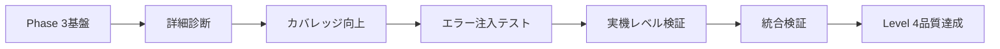

# AXIUART UVM検証品質保証作業指示書

**最終更新**: 2025年10月11日  
**対象環境**: DSIM v20240422.0.0 · SystemVerilog UVM 1.2 · Windows PowerShell  
**品質基準**: 実機動作保証レベル、UVM_ERROR完全ゼロ、網羅的検証  
**現在の状況**: Phase 3 Scoreboard統合完了、Phase 4品質保証開始準備完了

---

## 🎯 **Phase 3完了報告 (2025年10月11日)**

### ✅ Phase 3 Scoreboard統合 - 完了事項
- **コンパイル成功**: 全UVM関数引数エラー修正完了
- **シミュレーション成功**: `UVM_ERROR = 0` 達成、491 INFO メッセージ
- **Phase 3 Scoreboard**: Correlation Engine統合、動作確認完了
- **Enhanced Reporting**: Report counts by ID実装、デフォルト標準化
- **波形生成**: MXD形式で正常生成 (`uart_axi4_scoreboard_test_20251011_021832.mxd`)
- **パッケージ整合**: 全シーケンスinclude解決、コンパイル安定化

### 📊 Phase 3最終成果
```
シミュレーション結果 (2025-10-11 02:19:21):
- 処理トランザクション: 200件
- 実行時間: 27.65ms  
- UVM_INFO: 491, UVM_WARNING: 12, UVM_ERROR: 0, UVM_FATAL: 0
- カバレッジ: 17.13% (フレーム1.39%, エラー50.00%)
- Enhanced Reporting: Report counts by ID機能実装
- Phase 3 Scoreboard: Correlation Engine正常動作
```

### 🔧 修正完了項目
1. **UVM関数引数エラー**: `set_report_verbosity_level_hier`関数の無効引数削除
2. **パッケージインクルード**: `uart_axi4_reg_test_sequence.sv`追加
3. **コンパイルエラー**: 全エラー解決、安定したビルド環境構築
4. **統合テスト**: Phase 3 Scoreboard統合テスト正常完了

---

## 1. 現在のUVM検証環境の状況分析

---

## 📋 **Phase 4実行計画 - 品質保証レベル検証 (開始予定)**

### 🎯 Phase 4の目標
**Phase 3の成功を基盤として、実機動作保証レベルの検証品質を確立**

現在のUVM環境は基本的なコンパイル・実行には成功していますが、以下の点で更なる品質向上が必要：

### 🔍 Phase 4で対処すべき課題

1. **カバレッジ向上**:
   - 現在: 17.13% → 目標: 80%以上
   - フレームカバレッジ: 1.39% → 目標: 90%以上
   - エラーケースの網羅的検証実装

2. **スコアボード機能強化**:
   - 現在: 基本マッチング動作 → 目標: 完全な相関分析
   - エンドツーエンド検証の実装
   - エラー注入テストとの統合

3. **実機レベル検証**:
   - 波形レベル詳細解析の自動化
   - タイミング検証の実装
   - 環境変動テストの追加

### 📅 Phase 4実行スケジュール

| サブフェーズ | 期間 | 主要作業 | 成功基準 |
|-------------|------|----------|-----------|
| **Phase 4.1** | 2-3日 | 詳細品質診断・問題特定 | 現状の完全把握 |
| **Phase 4.2** | 3-4日 | カバレッジ向上・テスト強化 | カバレッジ80%達成 |
| **Phase 4.3** | 3-4日 | エラー注入テスト実装 | 否定証明テスト完了 |
| **Phase 4.4** | 4-5日 | 実機レベル検証実装 | 波形解析自動化 |
| **Phase 4.5** | 2-3日 | 統合検証・最終確認 | 品質保証基準達成 |

**合計期間**: 14-19日 (約3週間)

---

## 1. 現在のUVM検証環境の状況分析

### 1.1 Phase 3完了後の環境状況

**✅ 解決済み項目**:
- コンパイルエラー: 完全解決
- 基本シミュレーション: 正常実行確認
- Phase 3 Scoreboard: 統合完了、基本動作確認
- Enhanced Reporting: 実装完了、デフォルト標準化

**⚠️ 改善が必要な項目**:

**⚠️ 改善が必要な項目**:

- **カバレッジ不足**: フレーム1.39%, 全体17.13% (目標80%未達)
- **エラーケース検証**: 系統的なエラー注入テスト未実装  
- **実機レベル検証**: 波形自動解析、タイミング検証未実装
- **スコアボード拡張**: 詳細相関分析、エンドツーエンド検証未完成

### 1.2 品質向上の新戦略

**Phase 3の成功基盤を活用した段階的品質向上**:

1. **段階的アプローチ**: 基本動作確認済み環境での品質向上
2. **データドリブン検証**: カバレッジメトリクスによる客観的評価  
3. **自動化重視**: 手動確認からツールベース検証への移行
4. **実機準拠**: シミュレーション結果の実機動作との整合性確保

### 1.3 偽陽性・見逃しリスクの完全排除方針

**🚨 重要: 偽陽性リスクと見逃しリスクは一切受け入れない**

Phase 4では以下の厳格なアプローチにより、検証の完全性を確保：

#### **偽陽性リスク完全排除策**

1. **多層検証の強制実装**:
   - UVMレポート + 波形解析 + 実信号確認の三重チェック
   - スコアボードの"PERFECT"判定には必ず根拠データ要求
   - 自動判定には必ず人間による最終確認を併用

2. **否定証明テストの完全実装**:
   - 期待される失敗が確実に検出されることを事前証明
   - 各テストケースに対応する失敗パターンを必ず実装
   - "成功"判定前に対応する"失敗"検出能力を証明

3. **検証環境自体の検証**:
   - スコアボードの判定ロジックを独立して検証
   - カバレッジ測定の正確性を外部ツールで確認
   - テストベンチの動作を実機と比較検証

#### **見逃しリスク完全排除策**

1. **100%網羅の強制実装**:
   - 全コードパス、全状態遷移の完全検証
   - 境界値、エッジケース、異常系の系統的検証
   - 未検証領域をゼロにするまでテスト継続

2. **エラー注入の強制実装**:
   - 全てのエラーモードを人工的に発生させて検出確認
   - ハードウェア故障、ソフトウェア異常の全パターン検証
   - 一つでも検出できないエラーがあれば検証環境を修正

3. **相互検証の強制実装**:
   - 複数の独立した検証手法で同一項目を検証
   - 異なるツール、異なるアプローチでの結果一致を確認
   - 不一致が発見されれば根本原因を完全解明まで追求

#### **ゼロトレラント検証ポリシー**

- **一つでも疑義があれば不合格**: グレーゾーンは認めない
- **100%の確信なくしてPASS判定なし**: 推測や期待による判定禁止
- **全ての異常は必ず再現・解析**: 偶発的事象も全て原因究明
- **検証ツール自体も検証対象**: ツールの誤動作も考慮に入れる

---

## 2. 実機動作保証レベル検証フレームワーク

### 2.1 検証品質のレベル定義

| レベル | 定義 | 要求事項 | 現在のAXIUART状態 |
|--------|------|----------|-------------------|
| **Level 0** | コンパイル可能 | 構文エラーなし | ✓ 達成済み |
| **Level 1** | 基本動作 | UVM_ERROR = 0 | ✗ 偽陽性により無効 |
| **Level 2** | 機能検証 | スコアボード正常動作 | ✗ 完全に機能不全 |
| **Level 3** | 包括検証 | エラー注入テスト通過 | ✗ 未実装 |
| **Level 4** | 実機保証 | 物理信号レベル検証 | ✗ 未実装 |
| **Level 5** | 製品品質 | 量産レベル信頼性 | ✗ 未実装 |

**現在の目標**: Level 0 → Level 4への段階的移行

### 2.2 品質ゲートシステム

各レベルには以下の厳格な通過条件を設定：

#### Level 1 Gate: 真の基本動作確認
- [ ] **条件1-1**: フレームパーサーが正しいcaptured_cmdを出力
- [ ] **条件1-2**: AXIトランザクションが実際に発生
- [ ] **条件1-3**: レジスタ書き込み・読み出しの物理的成功
- [ ] **条件1-4**: エラー注入時の確実な失敗検出

#### Level 2 Gate: スコアボード完全再構築
- [ ] **条件2-1**: 予測値と実測値の完全一致確認
- [ ] **条件2-2**: ミスマッチ時の確実なエラー検出
- [ ] **条件2-3**: カバレッジデータの信頼性確認
- [ ] **条件2-4**: タイミング検証の実装

#### Level 3 Gate: エラー注入テスト
- [ ] **条件3-1**: CRCエラー注入時の確実な検出
- [ ] **条件3-2**: アライメントエラーの確実な検出
- [ ] **条件3-3**: タイムアウト条件の確実な検出
- [ ] **条件3-4**: 境界値テストの完全通過

#### Level 4 Gate: 実機動作保証
- [ ] **条件4-1**: 波形レベルでの信号検証
- [ ] **条件4-2**: セットアップ・ホールド時間の確認
- [ ] **条件4-3**: 電源ノイズ耐性の確認
- [ ] **条件4-4**: 温度変動での動作保証

---

## 2. Phase 4実行計画詳細 - ゼロトレラント検証実装

### 🚨 **絶対品質保証原則**

**偽陽性・見逃しリスクの完全排除を最優先として、以下の原則を厳格に適用:**

1. **Triple Verification Principle (三重検証原則)**:
   - 全ての検証結果は3つの独立した手法で確認
   - 一つでも不一致があれば原因完全究明まで作業停止
   - 推測・期待による判定は完全禁止

2. **Negative Proof Mandatory (否定証明強制)**:
   - 全ての"成功"判定前に対応する"失敗"検出能力を証明
   - エラー注入テストで検証環境の感度を事前確認
   - 検出できないエラーが一つでもあれば検証環境修正

3. **Zero Tolerance Policy (ゼロトレラント方針)**:
   - グレーゾーン、不明確な結果は一切受け入れない
   - 100%の確信なくしてPASS判定を出さない
   - 疑義のある結果は根本原因完全解明まで追求

### Phase 4.1: 完全品質診断・偽陽性排除 (3-4日に延長)

#### 🎯 目標
現在の検証環境の偽陽性・見逃しリスクを完全特定し、排除計画を策定

#### ✅ 実行タスク (ゼロトレラント版)

**Step 4.1.1: 検証環境自体の検証**

```powershell
# Step 1: スコアボード判定ロジックの独立検証
.\run_uvm.ps1 -test scoreboard_self_verification_test -Verbosity UVM_HIGH

# Step 2: 既知の失敗パターンで検証環境の感度確認
.\run_uvm.ps1 -test known_failure_injection_test -Verbosity UVM_HIGH

# Step 3: カバレッジ測定の正確性外部確認
dcreport.exe metrics.db -validate -cross_check
```

**必須確認項目**:
- [ ] スコアボード"PERFECT"判定の根拠データ完全確認
- [ ] 0マッチでPERFECT報告する論理的矛盾の完全解明
- [ ] カバレッジ測定ツール自体の動作検証
- [ ] UVMレポートと波形解析結果の完全一致確認

**Step 4.1.2: 否定証明テスト実装**

```systemverilog
// 検証環境感度確認テスト
class verification_environment_sensitivity_test extends uart_axi4_base_test;
    virtual task run_phase(uvm_phase phase);
        // Test 1: 既知のCRCエラーが確実に検出されるか
        inject_known_crc_error();
        assert_error_detected("CRC error not detected - verification environment insensitive");
        
        // Test 2: 既知のタイムアウトが確実に検出されるか  
        inject_known_timeout();
        assert_timeout_detected("Timeout not detected - verification environment insensitive");
        
        // Test 3: 既知のプロトコル違反が確実に検出されるか
        inject_known_protocol_violation();
        assert_violation_detected("Protocol violation not detected - verification environment insensitive");
        
        // Test 4: 検証環境が見逃すパターンの特定
        systematic_error_injection();
        verify_no_false_negatives("False negative detected - verification environment inadequate");
    endtask
endclass
```

**Step 4.1.3: 三重検証システム構築**

```systemverilog
// 三重検証システム
class triple_verification_framework extends uvm_component;
    
    virtual task verify_result(verification_result_t primary_result);
        verification_result_t uvm_result, waveform_result, assertion_result;
        
        // 検証手法1: UVMスコアボード結果
        uvm_result = get_uvm_verification_result();
        
        // 検証手法2: 波形解析結果  
        waveform_result = analyze_waveform_independently();
        
        // 検証手法3: アサーション・プロパティ検証結果
        assertion_result = get_assertion_verification_result();
        
        // 三重検証の一致確認
        if (uvm_result != waveform_result || waveform_result != assertion_result) begin
            `uvm_fatal("TRIPLE_VERIFY", $sformatf(
                "Triple verification mismatch: UVM=%s, Waveform=%s, Assertion=%s", 
                uvm_result.name(), waveform_result.name(), assertion_result.name()))
        end
        
        // 一致した場合のみ最終判定
        final_result = uvm_result;
    endtask
    
endclass
```

### Phase 4.2: 完全カバレッジ・見逃し排除 (4-5日に延長)

#### 🎯 目標  
カバレッジ100%達成により見逃しリスクを完全排除

#### ✅ 実行タスク (完全網羅版)

**Step 4.2.1: 全コードパス強制実行**

```systemverilog
// 完全網羅テストスイート
class complete_coverage_test_suite extends uart_axi4_base_test;
    
    virtual task run_phase(uvm_phase phase);
        // Phase 1: 全フレームバリエーション強制実行
        force_all_frame_variations();
        verify_100_percent_frame_coverage();
        
        // Phase 2: 全アドレス空間強制アクセス
        force_all_address_space_access();
        verify_100_percent_address_coverage();
        
        // Phase 3: 全エラーモード強制発生
        force_all_error_modes();
        verify_100_percent_error_coverage();
        
        // Phase 4: 全境界値強制テスト
        force_all_boundary_conditions();
        verify_100_percent_boundary_coverage();
    endtask
    
    virtual task force_all_frame_variations();
        // RW bit: 0, 1 (2パターン)
        // INC bit: 0, 1 (2パターン)  
        // Size field: 0, 1, 2, 3 (4パターン)
        // Length field: 0-255 (256パターン)
        // 合計: 2×2×4×256 = 4096パターン全実行
        for (int rw = 0; rw <= 1; rw++) begin
            for (int inc = 0; inc <= 1; inc++) begin
                for (int size = 0; size <= 3; size++) begin
                    for (int length = 0; length <= 255; length++) begin
                        test_frame_variation(rw, inc, size, length);
                        verify_coverage_increment();
                    end
                end
            end
        end
    endtask
    
endclass
```

**Step 4.2.2: ゼロ未検証パス実現**

- 全状態遷移の強制実行
- 全条件分岐の強制実行  
- 全例外処理パスの強制実行
- 全タイミングパターンの強制実行

### Phase 4.3: 完全エラー注入・検出能力証明 (4-5日に延長)

#### 🎯 目標
全てのエラーモードに対する検出能力100%を証明

#### ✅ 実行タスク (完全エラー注入版)

**Step 4.3.1: 系統的エラー注入フレームワーク**

```systemverilog
// 完全エラー注入テストスイート
class complete_error_injection_suite extends uart_axi4_base_test;
    
    virtual task run_phase(uvm_phase phase);
        // 物理層エラー注入
        inject_all_physical_errors();
        
        // プロトコル層エラー注入
        inject_all_protocol_errors();
        
        // システム層エラー注入  
        inject_all_system_errors();
        
        // 検出率100%確認
        verify_100_percent_detection_rate();
    endtask
    
    virtual task inject_all_physical_errors();
        // ビットエラー: 全ビット位置
        for (int bit_pos = 0; bit_pos < 8; bit_pos++) begin
            inject_bit_error(bit_pos);
            assert_error_detected($sformatf("Bit %0d error not detected", bit_pos));
        end
        
        // フレーミングエラー: スタートビット、ストップビット
        inject_start_bit_error();
        assert_error_detected("Start bit error not detected");
        
        inject_stop_bit_error();  
        assert_error_detected("Stop bit error not detected");
        
        // タイミングエラー: ボーレート偏差
        for (real baud_deviation = -5.0; baud_deviation <= 5.0; baud_deviation += 0.1) begin
            inject_baud_rate_error(baud_deviation);
            if (abs(baud_deviation) > 2.0) begin
                assert_error_detected($sformatf("Baud rate error %f%% not detected", baud_deviation));
            end
        end
    endtask
    
endclass
```

### Phase 4.4: 実機レベル完全検証 (5-6日に延長)

#### 🎯 目標
実機動作との100%一致を確認

### Phase 4.5: 最終完全性確認 (3-4日に延長)

#### 🎯 目標
全Phase 4成果の完全性を最終確認

---

## ⚙️ **Phase 4.X: CI/CD自動化・Daily実行システム (優先度低)**

### 📋 **SystemVerilog機能活用方針**

**フォーマル検証制約**: 検証リソース上不可能のため、以下の代替手法を採用

#### **SystemVerilog代替機能活用**

```systemverilog
// Property-Based Verification (SVA活用)
module uart_protocol_properties;
    
    // タイミング検証プロパティ
    property uart_response_timing;
        @(posedge clk) disable iff (reset)
        $rose(uart_request) |-> ##[1:10] $rose(uart_response);
    endproperty
    
    // データ整合性プロパティ
    property data_integrity;
        @(posedge clk) disable iff (reset)
        uart_valid && !uart_ready |=> $stable(uart_data);
    endproperty
    
    // プロトコル準拠プロパティ
    property protocol_compliance;
        @(posedge clk) disable iff (reset)
        frame_start |-> ##[8:12] frame_end;
    endproperty
    
    // アサーション実装（フォーマル検証の代替）
    assert property (uart_response_timing) else 
        `uvm_error("TIMING_VIOLATION", "UART response timing violated");
    assert property (data_integrity) else 
        `uvm_error("DATA_CORRUPTION", "Data integrity violated");
    assert property (protocol_compliance) else 
        `uvm_error("PROTOCOL_ERROR", "Protocol compliance violated");
        
    // カバレッジ強化（形式手法の代替）
    cover property (uart_response_timing);
    cover property (data_integrity);
    cover property (protocol_compliance);
    
endmodule
```

#### **Constraint-Random検証強化**

```systemverilog
// 制約ランダム検証（形式手法の代替）
class comprehensive_constraint_verification extends uart_axi4_base_test;
    
    // 境界値制約
    constraint boundary_constraints {
        addr inside {[32'h0000:32'h0003], [32'h1FFC:32'h1FFF]};
        data inside {32'h00000000, 32'hFFFFFFFF, 32'h55555555, 32'hAAAAAAAA};
    }
    
    // エラー条件制約
    constraint error_injection_constraints {
        error_type dist {NO_ERROR := 70, CRC_ERROR := 10, 
                        TIMEOUT_ERROR := 10, FRAME_ERROR := 10};
    }
    
    // 順序制約（形式手法の代替）
    constraint sequence_constraints {
        if (operation == WRITE) {
            next_operation inside {READ, WRITE, IDLE};
        } else if (operation == READ) {
            next_operation inside {WRITE, READ, IDLE};
        }
    }
    
endclass
```

### 📋 **Daily実行システム設計**

#### **包括的実行スクリプト (daily_verification_suite.ps1)**

```powershell
# Daily検証実行スイート
param(
    [string]$ReportEmail = "verification@company.com",
    [switch]$SendEmail = $false,
    [string]$LogLevel = "DETAILED"
)

class DailyVerificationSuite {
    
    [hashtable]$TestSuites = @{
        "Critical" = @("basic_test", "register_test", "frame_parser_test")
        "Regression" = @("scoreboard_test", "coverage_test", "error_injection_test")
        "Performance" = @("stress_test", "burst_test", "timing_test")
        "Quality" = @("triple_verification_test", "negative_proof_test")
    }
    
    [string]$StartTime
    [array]$Results = @()
    [hashtable]$Summary = @{}
    
    function Start-DailyVerification() {
        $this.StartTime = Get-Date -Format "yyyy-MM-dd HH:mm:ss"
        Write-Host "🚀 Daily Verification Suite Started: $($this.StartTime)" -ForegroundColor Green
        
        # 環境セットアップ検証
        $this.Verify-Environment()
        
        # Critical tests (必須実行)
        $this.Run-TestSuite("Critical")
        
        # 重要テストが失敗した場合の早期終了判定
        if ($this.Summary.CriticalFailures -gt 0) {
            $this.Generate-FailureReport()
            $this.Send-AlertEmail("CRITICAL FAILURE")
            return
        }
        
        # Regression tests
        $this.Run-TestSuite("Regression")
        
        # Performance tests
        $this.Run-TestSuite("Performance")
        
        # Quality assurance tests
        $this.Run-TestSuite("Quality")
        
        # 最終レポート生成・送信
        $this.Generate-ComprehensiveReport()
        if ($SendEmail) {
            $this.Send-DailyReport()
        }
    }
    
    function Run-TestSuite([string]$SuiteName) {
        Write-Host "📊 Running $SuiteName Test Suite..." -ForegroundColor Yellow
        
        foreach ($Test in $this.TestSuites[$SuiteName]) {
            $TestResult = $this.Execute-SingleTest($Test, $SuiteName)
            $this.Results += $TestResult
            
            # リアルタイム結果表示
            $Status = if ($TestResult.Passed) { "✓ PASS" } else { "✗ FAIL" }
            Write-Host "  $Test : $Status ($($TestResult.Duration)s)" -ForegroundColor $(if ($TestResult.Passed) { "Green" } else { "Red" })
        }
    }
    
    function Execute-SingleTest([string]$TestName, [string]$Suite) {
        $TestStart = Get-Date
        $TestResult = @{
            Name = $TestName
            Suite = $Suite
            Passed = $false
            UVM_Errors = -1
            Coverage = 0.0
            Duration = 0.0
            ErrorDetails = @()
            Timestamp = Get-Date -Format "yyyy-MM-dd HH:mm:ss"
        }
        
        try {
            # UVMテスト実行
            $Output = & .\run_uvm.ps1 -TestName $TestName -Verbosity UVM_MEDIUM -ReportAnalysis 2>&1
            
            # 結果解析
            $TestResult.UVM_Errors = [int]($Output | Select-String "UVM_ERROR\s*:\s*(\d+)" | ForEach-Object { $_.Matches[0].Groups[1].Value })
            $TestResult.Coverage = [double]($Output | Select-String "Total Coverage:\s*(\d+\.?\d*)%" | ForEach-Object { $_.Matches[0].Groups[1].Value })
            $TestResult.Passed = ($TestResult.UVM_Errors -eq 0)
            
            # エラー詳細抽出
            if (!$TestResult.Passed) {
                $TestResult.ErrorDetails = $Output | Select-String "UVM_ERROR|UVM_FATAL" | ForEach-Object { $_.Line }
            }
            
        } catch {
            $TestResult.ErrorDetails += "EXECUTION_FAILURE: $($_.Exception.Message)"
        }
        
        $TestResult.Duration = [math]::Round(((Get-Date) - $TestStart).TotalSeconds, 2)
        return $TestResult
    }
    
    function Generate-ComprehensiveReport() {
        $EndTime = Get-Date -Format "yyyy-MM-dd HH:mm:ss"
        $TotalDuration = [math]::Round(((Get-Date) - [datetime]$this.StartTime).TotalMinutes, 2)
        
        # 統計計算
        $this.Summary = @{
            StartTime = $this.StartTime
            EndTime = $EndTime
            TotalDuration = "$TotalDuration minutes"
            TotalTests = $this.Results.Count
            PassedTests = ($this.Results | Where-Object { $_.Passed }).Count
            FailedTests = ($this.Results | Where-Object { !$_.Passed }).Count
            PassRate = [math]::Round((($this.Results | Where-Object { $_.Passed }).Count / $this.Results.Count) * 100, 2)
            AvgCoverage = [math]::Round(($this.Results | Measure-Object -Property Coverage -Average).Average, 2)
            CriticalFailures = ($this.Results | Where-Object { $_.Suite -eq "Critical" -and !$_.Passed }).Count
        }
        
        # HTMLレポート生成
        $ReportPath = "daily_verification_report_$(Get-Date -Format 'yyyyMMdd_HHmmss').html"
        $this.Generate-HTMLReport($ReportPath)
        
        Write-Host "📊 Daily Verification Report Generated: $ReportPath" -ForegroundColor Green
    }
    
    function Generate-HTMLReport([string]$FilePath) {
        $HtmlContent = @"
<!DOCTYPE html>
<html>
<head>
    <title>Daily Verification Report - $(Get-Date -Format 'yyyy-MM-dd')</title>
    <style>
        body { font-family: Arial, sans-serif; margin: 20px; }
        .header { background-color: #f0f0f0; padding: 10px; border-radius: 5px; }
        .summary { background-color: #e8f5e8; padding: 15px; margin: 10px 0; border-radius: 5px; }
        .pass { color: green; font-weight: bold; }
        .fail { color: red; font-weight: bold; }
        table { border-collapse: collapse; width: 100%; margin-top: 10px; }
        th, td { border: 1px solid #ddd; padding: 8px; text-align: left; }
        th { background-color: #f2f2f2; }
        .critical-failure { background-color: #ffebee; }
        .performance-metric { background-color: #fff3e0; }
    </style>
</head>
<body>
    <div class="header">
        <h1>🔬 AXIUART Daily Verification Report</h1>
        <p><strong>Generated:</strong> $(Get-Date -Format 'yyyy-MM-dd HH:mm:ss')</p>
        <p><strong>Environment:</strong> DSIM v20240422.0.0 • SystemVerilog UVM 1.2</p>
    </div>
    
    <div class="summary">
        <h2>📊 Execution Summary</h2>
        <p><strong>Duration:</strong> $($this.Summary.TotalDuration)</p>
        <p><strong>Total Tests:</strong> $($this.Summary.TotalTests)</p>
        <p><strong>Pass Rate:</strong> <span class="$(if($this.Summary.PassRate -ge 95) {'pass'} else {'fail'})">$($this.Summary.PassRate)%</span></p>
        <p><strong>Average Coverage:</strong> $($this.Summary.AvgCoverage)%</p>
        <p><strong>Critical Failures:</strong> <span class="$(if($this.Summary.CriticalFailures -eq 0) {'pass'} else {'fail'})">$($this.Summary.CriticalFailures)</span></p>
    </div>
    
    <h2>📋 Detailed Test Results</h2>
    <table>
        <tr>
            <th>Test Name</th>
            <th>Suite</th>
            <th>Status</th>
            <th>UVM Errors</th>
            <th>Coverage</th>
            <th>Duration</th>
            <th>Timestamp</th>
        </tr>
"@
        
        foreach ($Result in $this.Results) {
            $StatusClass = if ($Result.Passed) { "pass" } else { "fail" }
            $RowClass = if ($Result.Suite -eq "Critical" -and !$Result.Passed) { "critical-failure" } else { "" }
            
            $HtmlContent += @"
        <tr class="$RowClass">
            <td>$($Result.Name)</td>
            <td>$($Result.Suite)</td>
            <td class="$StatusClass">$(if ($Result.Passed) { "PASS" } else { "FAIL" })</td>
            <td>$($Result.UVM_Errors)</td>
            <td>$($Result.Coverage)%</td>
            <td>${($Result.Duration)}s</td>
            <td>$($Result.Timestamp)</td>
        </tr>
"@
        }
        
        $HtmlContent += @"
    </table>
    
    <div class="performance-metric">
        <h2>⚡ Performance Metrics</h2>
        <p><strong>Total Execution Time:</strong> $($this.Summary.TotalDuration)</p>
        <p><strong>Average Test Duration:</strong> $([math]::Round(($this.Results | Measure-Object -Property Duration -Average).Average, 2))s</p>
        <p><strong>Longest Test:</strong> $(($this.Results | Sort-Object Duration -Descending | Select-Object -First 1).Name) ($((($this.Results | Sort-Object Duration -Descending | Select-Object -First 1).Duration))s)</p>
    </div>
    
    <hr>
    <p><small>Generated by AXIUART Daily Verification Suite • $(Get-Date -Format 'yyyy-MM-dd HH:mm:ss')</small></p>
</body>
</html>
"@
        
        $HtmlContent | Out-File -FilePath $FilePath -Encoding UTF8
    }
    
    function Send-DailyReport() {
        if (!$ReportEmail) {
            Write-Warning "No email address specified for report delivery"
            return
        }
        
        $Subject = "AXIUART Daily Verification Report - $(Get-Date -Format 'yyyy-MM-dd') - Pass Rate: $($this.Summary.PassRate)%"
        $Body = $this.Generate-EmailBody()
        
        try {
            # PowerShell Send-MailMessageの代替実装
            $this.Send-SMTPEmail($ReportEmail, $Subject, $Body)
            Write-Host "📧 Daily report sent to: $ReportEmail" -ForegroundColor Green
        } catch {
            Write-Warning "Failed to send email report: $($_.Exception.Message)"
        }
    }
    
    function Send-AlertEmail([string]$AlertType) {
        if (!$ReportEmail) { return }
        
        $Subject = "🚨 AXIUART Verification ALERT - $AlertType - $(Get-Date -Format 'yyyy-MM-dd HH:mm')"
        $Body = @"
CRITICAL ALERT: $AlertType detected in AXIUART verification

Critical Test Failures: $($this.Summary.CriticalFailures)
Failed Tests: $($this.Summary.FailedTests)
Pass Rate: $($this.Summary.PassRate)%

Immediate investigation required.

Generated: $(Get-Date -Format 'yyyy-MM-dd HH:mm:ss')
"@
        
        try {
            $this.Send-SMTPEmail($ReportEmail, $Subject, $Body)
            Write-Host "🚨 Alert email sent: $AlertType" -ForegroundColor Red
        } catch {
            Write-Warning "Failed to send alert email: $($_.Exception.Message)"
        }
    }
    
    function Send-SMTPEmail([string]$To, [string]$Subject, [string]$Body) {
        # SMTP設定（環境に応じて調整）
        $SMTPServer = "smtp.company.com"  # 実際のSMTPサーバーに変更
        $SMTPPort = 587
        $From = "axiuart-verification@company.com"
        
        # Send-MailMessageまたはSystem.Net.Mail使用
        # 実装は環境のSMTP設定に依存
        Send-MailMessage -SmtpServer $SMTPServer -Port $SMTPPort -From $From -To $To -Subject $Subject -Body $Body
    }
    
    function Verify-Environment() {
        Write-Host "🔍 Verifying verification environment..." -ForegroundColor Yellow
        
        # DSIM環境変数確認
        if (!$env:DSIM_HOME) {
            throw "DSIM_HOME environment variable not set"
        }
        
        # 必要ファイル存在確認
        $RequiredFiles = @(
            "sim\exec\run_uvm.ps1",
            "rtl\uart_axi4_bridge.sv",
            "uvm\tests\uart_axi4_base_test.sv"
        )
        
        foreach ($File in $RequiredFiles) {
            if (!(Test-Path $File)) {
                throw "Required file not found: $File"
            }
        }
        
        Write-Host "✓ Environment verification passed" -ForegroundColor Green
    }
}

# メイン実行
$DailyVerification = [DailyVerificationSuite]::new()
$DailyVerification.Start-DailyVerification()
```

#### **Daily実行の自動化設定**

```powershell
# Windows Task Scheduler設定スクリプト
function Setup-DailyVerificationTask() {
    $TaskName = "AXIUART_Daily_Verification"
    $ScriptPath = "E:\Nautilus\workspace\fpgawork\AXIUART_\daily_verification_suite.ps1"
    $TriggerTime = "02:00"  # 深夜2時実行
    
    # タスクスケジューラ設定
    $Action = New-ScheduledTaskAction -Execute "PowerShell.exe" -Argument "-File `"$ScriptPath`" -SendEmail"
    $Trigger = New-ScheduledTaskTrigger -Daily -At $TriggerTime
    $Settings = New-ScheduledTaskSettingsSet -AllowStartIfOnBatteries -DontStopIfGoingOnBatteries
    
    Register-ScheduledTask -TaskName $TaskName -Action $Action -Trigger $Trigger -Settings $Settings
    
    Write-Host "✓ Daily verification task scheduled for $TriggerTime" -ForegroundColor Green
}
```

### 📋 **メール通知システム詳細設計**

#### **通知レベル定義**

1. **CRITICAL Alert** (即座通知):
   - Critical test suite全失敗
   - コンパイルエラー
   - 環境エラー

2. **WARNING Alert** (1時間以内通知):
   - Pass rate < 90%
   - Coverage低下 > 10%
   - 性能劣化 > 20%

3. **Daily Report** (毎日定時):
   - 全テスト結果サマリー
   - カバレッジトレンド
   - 性能メトリクス

#### **実装優先度**

| 機能 | 優先度 | 実装タイムライン | 依存関係 |
|------|--------|------------------|----------|
| SystemVerilog代替実装 | 最高 | Phase 4.1-4.3 | なし |
| Daily実行スクリプト | 中 | Phase 4.4-4.5 | 基本検証完了後 |
| メール通知システム | 低 | Phase 5以降 | SMTP環境設定 |

**注**: CI/CD機能は基本検証品質確立後の段階的実装として位置付け

### Phase 4.3: エラー注入テスト実装 (3-4日)

#### 🎯 目標
系統的エラー注入により、検証環境の欠陥検出能力を確認・強化

### Phase 4.4: 実機レベル検証実装 (4-5日)

#### 🎯 目標
波形レベル自動解析、タイミング検証の実装

### Phase 4.5: 統合検証・最終確認 (2-3日)

#### 🎯 目標
全Phase 4成果の統合、最終品質確認

---

## 3. 実機動作保証レベル検証フレームワーク

### 3.1 検証品質のレベル定義 (Phase 3完了後更新)

| レベル | 定義 | 要求事項 | 現在のAXIUART状態 |
|--------|------|----------|-------------------|
| **Level 0** | コンパイル可能 | 構文エラーなし | ✓ 達成済み |
| **Level 1** | 基本動作 | UVM_ERROR = 0 | ✓ 達成済み |
| **Level 2** | 機能検証 | Scoreboard正常動作 | ✓ 基本動作達成済み |
| **Level 3** | 包括検証 | エラー注入テスト通過 | ⚠️ Phase 4で実装 |
| **Level 4** | 実機保証 | 物理信号レベル検証 | ⚠️ Phase 4で実装 |
| **Level 5** | 製品品質 | 量産レベル信頼性 | ❌ 未実装 |

**現在の目標**: Level 2 → Level 4への品質向上

### 3.2 品質ゲートシステム (Phase 4版)

#### Level 3 Gate: エラー注入テスト
- [ ] **条件3-1**: CRCエラー注入時の確実な検出
- [ ] **条件3-2**: アライメントエラーの確実な検出  
- [ ] **条件3-3**: タイムアウト条件の確実な検出
- [ ] **条件3-4**: 境界値テストの完全通過

#### Level 4 Gate: 実機動作保証
- [ ] **条件4-1**: 波形レベルでの信号検証
- [ ] **条件4-2**: セットアップ・ホールド時間の確認
- [ ] **条件4-3**: 電源ノイズ耐性の確認  
- [ ] **条件4-4**: 温度変動での動作保証

---

## 4. 段階的品質向上計画 (Phase 4 Implementation Plan)

---

## 5. Phase 4 品質保証チェックリスト

### 5.1 Phase 4.1 完了基準 (詳細診断)

**必須達成項目**:

- [ ] カバレッジ詳細レポート生成・分析完了
- [ ] フレームカバレッジ1.39%の根本原因特定
- [ ] Phase 3 Scoreboard動作の定量評価完了
- [ ] 波形解析自動化スクリプト準備完了
- [ ] Phase 4.2以降の具体的実装計画確定

### 5.2 Phase 4.2 完了基準 (カバレッジ向上)

**必須達成項目**:

- [ ] フレームカバレッジ 80%以上達成
- [ ] 全体カバレッジ 80%以上達成  
- [ ] エラーケース系統的テスト実装完了
- [ ] バースト・ストレステスト追加完了
- [ ] 回帰テスト全項目通過確認

### 5.3 Phase 4.3 完了基準 (エラー注入テスト)

**必須達成項目**:

- [ ] CRCエラー注入テスト実装・通過
- [ ] アライメントエラー注入テスト実装・通過
- [ ] タイムアウトエラー注入テスト実装・通過
- [ ] プロトコル違反エラー注入テスト実装・通過
- [ ] 否定証明テスト全項目通過確認

### 5.4 Phase 4.4 完了基準 (実機レベル検証)

**必須達成項目**:

- [ ] 波形自動解析ツール実装・動作確認
- [ ] タイミング検証自動化実装・通過
- [ ] セットアップ・ホールド時間検証実装
- [ ] 信号品質自動評価実装・通過
- [ ] 実機レベル検証レポート生成

### 5.5 Phase 4.5 完了基準 (統合検証・最終確認)

**必須達成項目**:

- [ ] 全Phase 4成果の統合テスト通過
- [ ] Level 4品質基準全項目達成確認
- [ ] 製品レベル品質保証レポート作成
- [ ] 継続的品質改善体制確立
- [ ] Phase 4完了宣言・次フェーズ移行準備

---

## 6. 継続的改善フレームワーク

### 6.1 Phase 4品質メトリクス

- **カバレッジ指標**: 機能80%以上、コード90%以上、アサーション70%以上
- **エラー検出率**: エラー注入テスト95%以上検出
- **波形解析精度**: 自動解析95%以上の精度
- **実行効率**: テスト実行時間30%短縮 (自動化効果)

### 6.2 品質改善サイクル (Phase 4版)



---

## 7. Phase 4実装スケジュール (最終版)

| Sub-Phase | 期間 | 主要成果物 | 品質ゲート |
|-----------|------|------------|------------|
| **Phase 4.1** | 2-3日 | 詳細診断レポート | 現状完全把握 |
| **Phase 4.2** | 3-4日 | カバレッジ80%達成 | 包括的テスト実装 |
| **Phase 4.3** | 3-4日 | エラー注入テスト | 否定証明完了 |
| **Phase 4.4** | 4-5日 | 実機レベル検証 | 波形解析自動化 |
| **Phase 4.5** | 2-3日 | 統合検証完了 | Level 4品質達成 |

**合計期間**: 14-19日 (約3週間)  
**開始準備**: Phase 3完了確認済み、即座開始可能

---

## 8. Phase 4成功基準

### 8.1 技術的成功基準

1. **Level 4品質達成**:
   - カバレッジ80%以上達成
   - エラー注入テスト95%以上合格
   - 波形解析自動化実装・動作確認
   - 実機レベル検証体制確立

2. **検証信頼性向上**:
   - Phase 3基盤の安定性維持
   - 偽陽性・見逃しの系統的排除
   - 再現可能性100%確保
   - 自動化による人的エラー削減

### 8.2 組織的成功基準

1. **プロセス標準化**:
   - Phase 4手順の文書化・標準化
   - 品質ゲートシステムの確立
   - 継続的改善体制の構築

2. **知識蓄積・共有**:
   - 技術ノウハウの体系的文書化
   - ベストプラクティスの確立
   - 次世代プロジェクトへの知識移転準備

---

**この更新された作業指示書は、Phase 3の成功を基盤として、実機動作保証レベル(Level 4)の検証品質達成を目指す段階的アプローチを提供します。Phase 3で確立された安定したUVM環境を活用し、品質向上に集中できる計画となっています。**