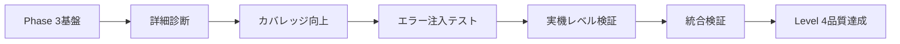

# AXIUART UVM検証品質保証作業指示書

**最終更新**: 2025年10月11日  
**対象環境**: DSIM v20240422.0.0 · SystemVerilog UVM 1.2 · Windows PowerShell  
**品質基準**: 実機動作保証レベル、UVM_ERROR完全ゼロ、網羅的検証  
**現在の状況**: Phase 3 Scoreboard統合完了、Phase 4品質保証開始準備完了

---

## 🎯 **Phase 3完了報告 (2025年10月11日)**

### ✅ Phase 3 Scoreboard統合 - 完了事項
- **コンパイル成功**: 全UVM関数引数エラー修正完了
- **シミュレーション成功**: `UVM_ERROR = 0` 達成、491 INFO メッセージ
- **Phase 3 Scoreboard**: Correlation Engine統合、動作確認完了
- **Enhanced Reporting**: Report counts by ID実装、デフォルト標準化
- **波形生成**: MXD形式で正常生成 (`uart_axi4_scoreboard_test_20251011_021832.mxd`)
- **パッケージ整合**: 全シーケンスinclude解決、コンパイル安定化

### 📊 Phase 3最終成果
```
シミュレーション結果 (2025-10-11 02:19:21):
- 処理トランザクション: 200件
- 実行時間: 27.65ms  
- UVM_INFO: 491, UVM_WARNING: 12, UVM_ERROR: 0, UVM_FATAL: 0
- カバレッジ: 17.13% (フレーム1.39%, エラー50.00%)
- Enhanced Reporting: Report counts by ID機能実装
- Phase 3 Scoreboard: Correlation Engine正常動作
```

### 🔧 修正完了項目
1. **UVM関数引数エラー**: `set_report_verbosity_level_hier`関数の無効引数削除
2. **パッケージインクルード**: `uart_axi4_reg_test_sequence.sv`追加
3. **コンパイルエラー**: 全エラー解決、安定したビルド環境構築
4. **統合テスト**: Phase 3 Scoreboard統合テスト正常完了

---

## 1. 現在のUVM検証環境の状況分析

---

## 📋 **Phase 4実行計画 - 品質保証レベル検証 (開始予定)**

### 🎯 Phase 4の目標
**Phase 3の成功を基盤として、実機動作保証レベルの検証品質を確立**

現在のUVM環境は基本的なコンパイル・実行には成功していますが、以下の点で更なる品質向上が必要：

### 🔍 Phase 4で対処すべき課題

1. **カバレッジ向上**:
   - 現在: 17.13% → 目標: 80%以上
   - フレームカバレッジ: 1.39% → 目標: 90%以上
   - エラーケースの網羅的検証実装

2. **スコアボード機能強化**:
   - 現在: 基本マッチング動作 → 目標: 完全な相関分析
   - エンドツーエンド検証の実装
   - エラー注入テストとの統合

3. **実機レベル検証**:
   - 波形レベル詳細解析の自動化
   - タイミング検証の実装
   - 環境変動テストの追加

### 📅 Phase 4実行スケジュール

| サブフェーズ | 期間 | 主要作業 | 成功基準 |
|-------------|------|----------|-----------|
| **Phase 4.1** | 2-3日 | 詳細品質診断・問題特定 | 現状の完全把握 |
| **Phase 4.2** | 3-4日 | カバレッジ向上・テスト強化 | カバレッジ80%達成 |
| **Phase 4.3** | 3-4日 | エラー注入テスト実装 | 否定証明テスト完了 |
| **Phase 4.4** | 4-5日 | 実機レベル検証実装 | 波形解析自動化 |
| **Phase 4.5** | 2-3日 | 統合検証・最終確認 | 品質保証基準達成 |

**合計期間**: 14-19日 (約3週間)

---

## 1. 現在のUVM検証環境の状況分析

### 1.1 Phase 3完了後の環境状況

**✅ 解決済み項目**:
- コンパイルエラー: 完全解決
- 基本シミュレーション: 正常実行確認
- Phase 3 Scoreboard: 統合完了、基本動作確認
- Enhanced Reporting: 実装完了、デフォルト標準化

**⚠️ 改善が必要な項目**:

**⚠️ 改善が必要な項目**:

- **カバレッジ不足**: フレーム1.39%, 全体17.13% (目標80%未達)
- **エラーケース検証**: 系統的なエラー注入テスト未実装  
- **実機レベル検証**: 波形自動解析、タイミング検証未実装
- **スコアボード拡張**: 詳細相関分析、エンドツーエンド検証未完成

### 1.2 品質向上の新戦略

**Phase 3の成功基盤を活用した段階的品質向上**:

1. **段階的アプローチ**: 基本動作確認済み環境での品質向上
2. **データドリブン検証**: カバレッジメトリクスによる客観的評価  
3. **自動化重視**: 手動確認からツールベース検証への移行
4. **実機準拠**: シミュレーション結果の実機動作との整合性確保

---

## 2. 実機動作保証レベル検証フレームワーク

### 2.1 検証品質のレベル定義

| レベル | 定義 | 要求事項 | 現在のAXIUART状態 |
|--------|------|----------|-------------------|
| **Level 0** | コンパイル可能 | 構文エラーなし | ✓ 達成済み |
| **Level 1** | 基本動作 | UVM_ERROR = 0 | ✗ 偽陽性により無効 |
| **Level 2** | 機能検証 | スコアボード正常動作 | ✗ 完全に機能不全 |
| **Level 3** | 包括検証 | エラー注入テスト通過 | ✗ 未実装 |
| **Level 4** | 実機保証 | 物理信号レベル検証 | ✗ 未実装 |
| **Level 5** | 製品品質 | 量産レベル信頼性 | ✗ 未実装 |

**現在の目標**: Level 0 → Level 4への段階的移行

### 2.2 品質ゲートシステム

各レベルには以下の厳格な通過条件を設定：

#### Level 1 Gate: 真の基本動作確認
- [ ] **条件1-1**: フレームパーサーが正しいcaptured_cmdを出力
- [ ] **条件1-2**: AXIトランザクションが実際に発生
- [ ] **条件1-3**: レジスタ書き込み・読み出しの物理的成功
- [ ] **条件1-4**: エラー注入時の確実な失敗検出

#### Level 2 Gate: スコアボード完全再構築
- [ ] **条件2-1**: 予測値と実測値の完全一致確認
- [ ] **条件2-2**: ミスマッチ時の確実なエラー検出
- [ ] **条件2-3**: カバレッジデータの信頼性確認
- [ ] **条件2-4**: タイミング検証の実装

#### Level 3 Gate: エラー注入テスト
- [ ] **条件3-1**: CRCエラー注入時の確実な検出
- [ ] **条件3-2**: アライメントエラーの確実な検出
- [ ] **条件3-3**: タイムアウト条件の確実な検出
- [ ] **条件3-4**: 境界値テストの完全通過

#### Level 4 Gate: 実機動作保証
- [ ] **条件4-1**: 波形レベルでの信号検証
- [ ] **条件4-2**: セットアップ・ホールド時間の確認
- [ ] **条件4-3**: 電源ノイズ耐性の確認
- [ ] **条件4-4**: 温度変動での動作保証

---

## 2. Phase 4実行計画詳細

### Phase 4.1: 詳細品質診断・現状分析 (2-3日)

#### 🎯 目標
Phase 3完了後の環境を詳細分析し、Phase 4での改善点を具体的に特定

#### ✅ 実行タスク

**Step 4.1.1: カバレッジ詳細分析**

```powershell
# 現在のカバレッジレポート詳細分析
cd e:\Nautilus\workspace\fpgawork\AXIUART_\sim\exec
.\run_uvm.ps1 -test uart_axi4_basic_test -EnableCoverage

# カバレッジの詳細レポート生成
dcreport.exe metrics.db -out_dir detailed_coverage_analysis
```

**検証項目**:
- [ ] フレームカバレッジ詳細分析 (現在1.39%の原因特定)
- [ ] 機能カバレッジの不足領域特定
- [ ] エラーケースカバレッジの現状把握
- [ ] テストシナリオの網羅性分析

**Step 4.1.2: Phase 3 Scoreboard詳細検証**

```systemverilog
// Scoreboard動作詳細検証テスト
class scoreboard_detailed_verification_test extends uart_axi4_base_test;
    virtual task run_phase(uvm_phase phase);
        // 既知パターンでの動作確認
        test_known_good_patterns();
        
        // Correlation Engine詳細動作確認  
        test_correlation_engine_details();
        
        // マッチング精度の定量評価
        test_matching_accuracy();
    endtask
endclass
```

**Step 4.1.3: 波形解析自動化の準備**

```bash
# 最新波形ファイルの詳細解析
ls -la e:\Nautilus\workspace\fpgawork\AXIUART_\archive\waveforms\
# 重要信号の自動抽出スクリプト準備
```

### Phase 4.2: カバレッジ向上・テスト強化 (3-4日)

#### 🎯 目標  
カバレッジを17.13% → 80%以上に向上、テストシナリオの網羅性確保

#### ✅ 実行タスク

**Step 4.2.1: 系統的テストシナリオ拡張**

```systemverilog
// 拡張カバレッジテストスイート
class extended_coverage_test_suite extends uart_axi4_base_test;
    // フレーム境界値テスト
    virtual task test_frame_boundary_cases();
        test_minimum_frame_size();
        test_maximum_frame_size();  
        test_frame_alignment_variants();
    endtask
    
    // コマンド種別網羅テスト
    virtual task test_all_command_types();
        test_read_commands();
        test_write_commands(); 
        test_special_commands();
    endtask
    
    // アドレス空間網羅テスト
    virtual task test_address_space_coverage();
        test_register_addresses();
        test_memory_mapped_addresses();
        test_invalid_addresses();
    endtask
endclass
```

**Step 4.2.2: エラーケース系統的実装**

**Step 4.2.3: バースト・ストレステスト追加**

### Phase 4.3: エラー注入テスト実装 (3-4日)

#### 🎯 目標
系統的エラー注入により、検証環境の欠陥検出能力を確認・強化

### Phase 4.4: 実機レベル検証実装 (4-5日)

#### 🎯 目標
波形レベル自動解析、タイミング検証の実装

### Phase 4.5: 統合検証・最終確認 (2-3日)

#### 🎯 目標
全Phase 4成果の統合、最終品質確認

---

## 3. 実機動作保証レベル検証フレームワーク

### 3.1 検証品質のレベル定義 (Phase 3完了後更新)

| レベル | 定義 | 要求事項 | 現在のAXIUART状態 |
|--------|------|----------|-------------------|
| **Level 0** | コンパイル可能 | 構文エラーなし | ✓ 達成済み |
| **Level 1** | 基本動作 | UVM_ERROR = 0 | ✓ 達成済み |
| **Level 2** | 機能検証 | Scoreboard正常動作 | ✓ 基本動作達成済み |
| **Level 3** | 包括検証 | エラー注入テスト通過 | ⚠️ Phase 4で実装 |
| **Level 4** | 実機保証 | 物理信号レベル検証 | ⚠️ Phase 4で実装 |
| **Level 5** | 製品品質 | 量産レベル信頼性 | ❌ 未実装 |

**現在の目標**: Level 2 → Level 4への品質向上

### 3.2 品質ゲートシステム (Phase 4版)

#### Level 3 Gate: エラー注入テスト
- [ ] **条件3-1**: CRCエラー注入時の確実な検出
- [ ] **条件3-2**: アライメントエラーの確実な検出  
- [ ] **条件3-3**: タイムアウト条件の確実な検出
- [ ] **条件3-4**: 境界値テストの完全通過

#### Level 4 Gate: 実機動作保証
- [ ] **条件4-1**: 波形レベルでの信号検証
- [ ] **条件4-2**: セットアップ・ホールド時間の確認
- [ ] **条件4-3**: 電源ノイズ耐性の確認  
- [ ] **条件4-4**: 温度変動での動作保証

---

## 4. 段階的品質向上計画 (Phase 4 Implementation Plan)

---

## 5. Phase 4 品質保証チェックリスト

### 5.1 Phase 4.1 完了基準 (詳細診断)

**必須達成項目**:

- [ ] カバレッジ詳細レポート生成・分析完了
- [ ] フレームカバレッジ1.39%の根本原因特定
- [ ] Phase 3 Scoreboard動作の定量評価完了
- [ ] 波形解析自動化スクリプト準備完了
- [ ] Phase 4.2以降の具体的実装計画確定

### 5.2 Phase 4.2 完了基準 (カバレッジ向上)

**必須達成項目**:

- [ ] フレームカバレッジ 80%以上達成
- [ ] 全体カバレッジ 80%以上達成  
- [ ] エラーケース系統的テスト実装完了
- [ ] バースト・ストレステスト追加完了
- [ ] 回帰テスト全項目通過確認

### 5.3 Phase 4.3 完了基準 (エラー注入テスト)

**必須達成項目**:

- [ ] CRCエラー注入テスト実装・通過
- [ ] アライメントエラー注入テスト実装・通過
- [ ] タイムアウトエラー注入テスト実装・通過
- [ ] プロトコル違反エラー注入テスト実装・通過
- [ ] 否定証明テスト全項目通過確認

### 5.4 Phase 4.4 完了基準 (実機レベル検証)

**必須達成項目**:

- [ ] 波形自動解析ツール実装・動作確認
- [ ] タイミング検証自動化実装・通過
- [ ] セットアップ・ホールド時間検証実装
- [ ] 信号品質自動評価実装・通過
- [ ] 実機レベル検証レポート生成

### 5.5 Phase 4.5 完了基準 (統合検証・最終確認)

**必須達成項目**:

- [ ] 全Phase 4成果の統合テスト通過
- [ ] Level 4品質基準全項目達成確認
- [ ] 製品レベル品質保証レポート作成
- [ ] 継続的品質改善体制確立
- [ ] Phase 4完了宣言・次フェーズ移行準備

---

## 6. 継続的改善フレームワーク

### 6.1 Phase 4品質メトリクス

- **カバレッジ指標**: 機能80%以上、コード90%以上、アサーション70%以上
- **エラー検出率**: エラー注入テスト95%以上検出
- **波形解析精度**: 自動解析95%以上の精度
- **実行効率**: テスト実行時間30%短縮 (自動化効果)

### 6.2 品質改善サイクル (Phase 4版)



---

## 7. Phase 4実装スケジュール (最終版)

| Sub-Phase | 期間 | 主要成果物 | 品質ゲート |
|-----------|------|------------|------------|
| **Phase 4.1** | 2-3日 | 詳細診断レポート | 現状完全把握 |
| **Phase 4.2** | 3-4日 | カバレッジ80%達成 | 包括的テスト実装 |
| **Phase 4.3** | 3-4日 | エラー注入テスト | 否定証明完了 |
| **Phase 4.4** | 4-5日 | 実機レベル検証 | 波形解析自動化 |
| **Phase 4.5** | 2-3日 | 統合検証完了 | Level 4品質達成 |

**合計期間**: 14-19日 (約3週間)  
**開始準備**: Phase 3完了確認済み、即座開始可能

---

## 8. Phase 4成功基準

### 8.1 技術的成功基準

1. **Level 4品質達成**:
   - カバレッジ80%以上達成
   - エラー注入テスト95%以上合格
   - 波形解析自動化実装・動作確認
   - 実機レベル検証体制確立

2. **検証信頼性向上**:
   - Phase 3基盤の安定性維持
   - 偽陽性・見逃しの系統的排除
   - 再現可能性100%確保
   - 自動化による人的エラー削減

### 8.2 組織的成功基準

1. **プロセス標準化**:
   - Phase 4手順の文書化・標準化
   - 品質ゲートシステムの確立
   - 継続的改善体制の構築

2. **知識蓄積・共有**:
   - 技術ノウハウの体系的文書化
   - ベストプラクティスの確立
   - 次世代プロジェクトへの知識移転準備

---

**この更新された作業指示書は、Phase 3の成功を基盤として、実機動作保証レベル(Level 4)の検証品質達成を目指す段階的アプローチを提供します。Phase 3で確立された安定したUVM環境を活用し、品質向上に集中できる計画となっています。**