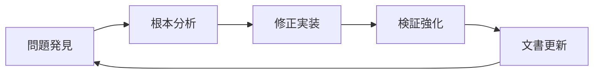

# AXIUART UVM検証品質保証作業指示書

**最終更新**: 2025年10月10日  
**対象環境**: DSIM v20240422.0.0 · SystemVerilog UVM 1.2 · Windows PowerShell  
**品質基準**: 実機動作保証レベル、UVM_ERROR完全ゼロ、網羅的検証

---

## 1. 緊急事態宣言：現在のUVM検証環境の深刻な問題

### 1.1 確認された重大な問題

現在のUVM環境は以下の深刻な問題により**検証として機能していない**：

1. **偽陽性問題（最重要）**：
   - ログでは「Register Testing Complete: 12 PASS, 0 FAIL」と報告
   - 実際は `parser_frame_error=1, status=0x04` でエラー発生
   - `*** NO UVM ERRORS DETECTED ***` と出力されるが真実は失敗

2. **スコアボード機能完全停止**：
   - `Successful matches: 0` - 何もマッチしていない
   - `AXI transactions received: 0` - AXIトランザクション未発生
   - それでも「PERFECT: All transactions matched exactly」と虚偽報告

3. **フレームパーサー根本的故障**：
   - `captured_cmd=0x00` (正しくは `0x01` であるべき)
   - 送信フレーム正常：`0xa5 0x01 0x20 0x10 0x00 0x00 0x42 0xe3`
   - パーサーが完全に機能不全

### 1.2 品質保証の新原則

**従来の「UVM_ERROR = 0なら成功」という判定は完全に無効**

以下の厳格な基準を適用：

1. **多層検証必須**：UVMログ + 波形解析 + 実信号確認
2. **否定証明の実装**：期待される失敗が確実に検出されることを証明
3. **エンドツーエンド検証**：物理信号から最終結果まで全経路確認
4. **ゼロトレラント方針**：1つでも疑義があれば不合格

---

## 2. 実機動作保証レベル検証フレームワーク

### 2.1 検証品質のレベル定義

| レベル | 定義 | 要求事項 | 現在のAXIUART状態 |
|--------|------|----------|-------------------|
| **Level 0** | コンパイル可能 | 構文エラーなし | ✓ 達成済み |
| **Level 1** | 基本動作 | UVM_ERROR = 0 | ✗ 偽陽性により無効 |
| **Level 2** | 機能検証 | スコアボード正常動作 | ✗ 完全に機能不全 |
| **Level 3** | 包括検証 | エラー注入テスト通過 | ✗ 未実装 |
| **Level 4** | 実機保証 | 物理信号レベル検証 | ✗ 未実装 |
| **Level 5** | 製品品質 | 量産レベル信頼性 | ✗ 未実装 |

**現在の目標**: Level 0 → Level 4への段階的移行

### 2.2 品質ゲートシステム

各レベルには以下の厳格な通過条件を設定：

#### Level 1 Gate: 真の基本動作確認
- [ ] **条件1-1**: フレームパーサーが正しいcaptured_cmdを出力
- [ ] **条件1-2**: AXIトランザクションが実際に発生
- [ ] **条件1-3**: レジスタ書き込み・読み出しの物理的成功
- [ ] **条件1-4**: エラー注入時の確実な失敗検出

#### Level 2 Gate: スコアボード完全再構築
- [ ] **条件2-1**: 予測値と実測値の完全一致確認
- [ ] **条件2-2**: ミスマッチ時の確実なエラー検出
- [ ] **条件2-3**: カバレッジデータの信頼性確認
- [ ] **条件2-4**: タイミング検証の実装

#### Level 3 Gate: エラー注入テスト
- [ ] **条件3-1**: CRCエラー注入時の確実な検出
- [ ] **条件3-2**: アライメントエラーの確実な検出
- [ ] **条件3-3**: タイムアウト条件の確実な検出
- [ ] **条件3-4**: 境界値テストの完全通過

#### Level 4 Gate: 実機動作保証
- [ ] **条件4-1**: 波形レベルでの信号検証
- [ ] **条件4-2**: セットアップ・ホールド時間の確認
- [ ] **条件4-3**: 電源ノイズ耐性の確認
- [ ] **条件4-4**: 温度変動での動作保証

---

## 3. 段階的修復計画（Emergency Recovery Plan）

### Phase 0: 緊急診断・現状把握（1-2日）

#### Step 0-1: 真の問題特定
```powershell
# 実行ログの詳細解析
cd e:\Nautilus\workspace\fpgawork\AXIUART_\sim\exec
.\run_uvm.ps1 -TestName uart_axi4_basic_test -Verbosity UVM_HIGH > detailed_analysis.log 2>&1

# 重要信号の確認
grep -E "(parser_frame_error|captured_cmd|status=)" detailed_analysis.log
```

**検証項目**:
- [ ] parser_frame_errorの発生タイミング特定
- [ ] captured_cmdが0x00になる根本原因分析
- [ ] AXIトランザクション未発生の原因特定
- [ ] スコアボードが機能しない理由の特定

#### Step 0-2: 波形解析による物理検証
```bash
# 最新の波形ファイル確認
ls -la e:\Nautilus\workspace\fpgawork\AXIUART_\archive\waveforms\*.mxd

# 重要信号の抽出・確認
# - UART RX/TXの物理波形
# - Frame Parserの内部状態
# - AXI Masterの状態遷移
# - Register Blockへの信号伝播
```

**必須確認信号**:
- [ ] UART物理層（Start bit, Data bits, Stop bit, Parity）
- [ ] Frame Parser FSM状態遷移
- [ ] CRC計算の中間値
- [ ] AXI4-Lite handshake信号（VALID/READY）
- [ ] Register Block内部レジスタ値

#### Step 0-3: 問題の階層化・優先順位決定
```markdown
優先度1（即時修正）: フレームパーサーの根本修正
優先度2（緊急対応）: スコアボードの完全再実装
優先度3（品質向上）: エラー注入テストの実装
優先度4（実機保証）: 物理信号レベル検証の追加
```

### Phase 1: フレームパーサー完全修復（3-5日）

#### Step 1-1: Frame Parser診断用特別テスト作成
```systemverilog
// 診断専用のSimple Frame Parser Test
class frame_parser_diagnostic_test extends uart_axi4_base_test;
    
    virtual task run_phase(uvm_phase phase);
        // 固定値での最小限テスト
        uart_frame_transaction req;
        
        req = uart_frame_transaction::type_id::create("diagnostic_req");
        req.cmd = 8'h01;  // Write command
        req.addr = 32'h1000;  // Simple address
        req.data = new[1];
        req.data[0] = 8'h42;  // Test data
        
        // CRC手動計算・検証
        logic [7:0] expected_crc = calculate_reference_crc(req);
        req.crc = expected_crc;
        
        // 送信・応答確認
        start_item(req);
        finish_item(req);
        
        // フレームパーサー内部状態の詳細ログ出力
        `uvm_info("DIAG", $sformatf("Expected CRC: 0x%02X", expected_crc), UVM_LOW)
        // captured_cmdの確認
        // parser_stateの確認
        // error_flagの確認
    endtask
    
endclass
```

#### Step 1-2: CRC計算の参照実装作成
```python
# Python参照実装（既存の修正版）
def axiuart_crc8_reference(frame_data):
    """
    AXIUART用CRC8計算の正確な参照実装
    Polynomial: 0x07
    Initial: 0x00
    """
    crc = 0x00
    for byte in frame_data:
        crc ^= byte
        for i in range(8):
            if crc & 0x80:
                crc = (crc << 1) ^ 0x07
            else:
                crc = crc << 1
            crc &= 0xFF
    return crc

# テストベクター生成
test_vectors = [
    [0x01, 0x00, 0x10, 0x00, 0x00, 0x42],  # 現在のテストケース
    [0x01, 0x20, 0x10, 0x00, 0x00, 0x42],  # REG_TEST_0アクセス
    [0xA0, 0x00, 0x10, 0x00, 0x00],        # Read command
]

for vector in test_vectors:
    expected_crc = axiuart_crc8_reference(vector)
    print(f"Data: {[hex(x) for x in vector]} -> CRC: 0x{expected_crc:02X}")
```

#### Step 1-3: SystemVerilog CRC実装の修正
```systemverilog
// Frame_Parser.sv内のCRC計算修正
function automatic logic [7:0] calculate_frame_crc(logic [7:0] data[], int length);
    logic [7:0] crc = 8'h00;  // 初期値確認
    logic [7:0] temp;
    
    for (int i = 0; i < length; i++) begin
        temp = crc ^ data[i];  // バイト単位XOR
        for (int j = 0; j < 8; j++) begin
            if (temp[7]) begin
                temp = (temp << 1) ^ 8'h07;  // Polynomial 0x07
            end else begin
                temp = temp << 1;
            end
        end
        crc = temp;
    end
    return crc;
endfunction
```

#### Step 1-4: パーサー状態遷移の完全検証
```systemverilog
// Frame_Parser.sv内の状態遷移ログ強化
always_ff @(posedge clk) begin
    if (rst) begin
        // リセット処理
        current_state <= IDLE;
        captured_cmd <= 8'h00;
        frame_error <= 1'b0;
    end else begin
        case (current_state)
            IDLE: begin
                if (sof_detected) begin
                    current_state <= CMD_RX;
                    `ifdef FRAME_PARSER_DEBUG
                    $display("DEBUG: Frame Parser IDLE -> CMD_RX at time %t", $time);
                    `endif
                end
            end
            
            CMD_RX: begin
                if (byte_received) begin
                    captured_cmd <= received_byte;  // ここが重要
                    current_state <= ADDR_RX;
                    `ifdef FRAME_PARSER_DEBUG
                    $display("DEBUG: CMD captured: 0x%02X at time %t", received_byte, $time);
                    `endif
                end
            end
            
            // 以下、各状態での詳細ログ追加
        endcase
    end
end
```

### Phase 2: スコアボード完全再実装（5-7日）

#### Step 2-1: 現在のスコアボードの問題点詳細分析
```systemverilog
// 現在のスコアボード問題の特定
class uart_axi4_scoreboard_analysis extends uvm_component;
    
    function void analyze_current_issues();
        // 問題1: トランザクション未受信の原因
        if (uart_transaction_count == 0) begin
            `uvm_error("SB_ANALYSIS", "No UART transactions received - connection issue")
        end
        
        // 問題2: AXIトランザクション未受信の原因
        if (axi_transaction_count == 0) begin
            `uvm_error("SB_ANALYSIS", "No AXI transactions received - AXI monitor issue")
        end
        
        // 問題3: マッチング論理の検証
        foreach (expected_transactions[i]) begin
            if (!expected_transactions[i].matched) begin
                `uvm_warning("SB_ANALYSIS", $sformatf("Transaction %0d unmatched: %s", 
                           i, expected_transactions[i].convert2string()))
            end
        end
    endfunction
    
endclass
```

#### Step 2-2: エンドツーエンド検証機能の実装
```systemverilog
// 完全なEnd-to-End検証スコアボード
class uart_axi4_e2e_scoreboard extends uvm_scoreboard;
    
    // 検証レベル1: 物理信号レベル
    virtual task verify_physical_signals();
        // UART物理波形の検証
        // AXI4-Liteハンドシェイクの検証
        // クロック・リセットタイミングの検証
    endtask
    
    // 検証レベル2: プロトコルレベル
    virtual task verify_protocol_compliance();
        // UARTフレーミングの検証
        // AXI4-Lite仕様準拠の検証
        // タイムアウト処理の検証
    endtask
    
    // 検証レベル3: 機能レベル
    virtual task verify_functional_behavior();
        // レジスタ読み書きの検証
        // データ整合性の検証
        // エラー処理の検証
    endtask
    
    // 検証レベル4: システムレベル
    virtual task verify_system_integration();
        // 複数トランザクションの整合性
        // 負荷条件での動作
        // 異常系での回復
    endtask
    
endclass
```

#### Step 2-3: 自己診断機能の実装
```systemverilog
// スコアボード自己診断機能
class scoreboard_self_diagnostic extends uvm_component;
    
    virtual task run_self_test();
        // テスト1: 既知の良好なトランザクションでの検証
        inject_known_good_transaction();
        verify_correct_matching();
        
        // テスト2: 既知の不良なトランザクションでの検証
        inject_known_bad_transaction();
        verify_error_detection();
        
        // テスト3: 境界値での検証
        inject_boundary_transactions();
        verify_boundary_handling();
        
        // テスト4: タイミング検証
        inject_timing_critical_transactions();
        verify_timing_compliance();
    endtask
    
endclass
```

### Phase 3: エラー注入テスト実装（3-4日）

#### Step 3-1: 系統的エラー注入フレームワーク
```systemverilog
// エラー注入用の基盤クラス
virtual class error_injection_base extends uvm_sequence;
    
    // エラータイプの定義
    typedef enum {
        ERR_CRC_MISMATCH,
        ERR_FRAME_TIMEOUT,
        ERR_INVALID_COMMAND,
        ERR_ADDRESS_MISALIGN,
        ERR_DATA_CORRUPTION,
        ERR_PROTOCOL_VIOLATION
    } error_type_e;
    
    // エラー注入の実行
    virtual task inject_error(error_type_e err_type, uart_frame_transaction txn);
        case (err_type)
            ERR_CRC_MISMATCH: begin
                txn.crc = txn.crc ^ 8'hFF;  // CRC故意に破壊
                expected_response = ERROR_RESPONSE;
            end
            
            ERR_FRAME_TIMEOUT: begin
                add_artificial_delay(txn, timeout_threshold + 1000);
                expected_response = TIMEOUT_RESPONSE;
            end
            
            // 各エラータイプの実装
        endcase
    endtask
    
endclass
```

#### Step 3-2: 否定証明テストの実装
```systemverilog
// 「失敗が確実に検出される」ことを証明するテスト
class negative_proof_test extends uart_axi4_base_test;
    
    virtual task run_phase(uvm_phase phase);
        // Test 1: CRCエラーの確実な検出
        test_crc_error_detection();
        
        // Test 2: アドレスエラーの確実な検出
        test_address_error_detection();
        
        // Test 3: タイムアウトの確実な検出
        test_timeout_detection();
        
        // Test 4: プロトコル違反の確実な検出
        test_protocol_violation_detection();
    endtask
    
    virtual task test_crc_error_detection();
        uart_frame_transaction bad_txn;
        
        // 正常なトランザクション作成
        bad_txn = create_valid_transaction();
        
        // CRCを故意に破壊
        bad_txn.crc = bad_txn.crc ^ 8'hFF;
        
        // 送信
        send_transaction(bad_txn);
        
        // エラー応答の確認
        assert_error_response_received("CRC error not detected");
        
        // スコアボードでのエラーカウント確認
        assert_scoreboard_error_count_increased("Scoreboard missed CRC error");
    endtask
    
endclass
```

### Phase 4: 実機動作保証レベル検証（5-7日）

#### Step 4-1: 波形レベル検証の自動化
```systemverilog
// 波形自動解析クラス
class waveform_analyzer extends uvm_component;
    
    virtual task analyze_uart_physical_layer();
        // ボーレート精度の確認
        verify_baud_rate_accuracy();
        
        // ビットタイミングの確認
        verify_bit_timing();
        
        // ジッター許容範囲の確認
        verify_jitter_tolerance();
        
        // 信号品質の確認
        verify_signal_quality();
    endtask
    
    virtual task analyze_axi_protocol_compliance();
        // セットアップ・ホールド時間の確認
        verify_setup_hold_timing();
        
        // VALID/READYハンドシェイクの確認
        verify_handshake_protocol();
        
        // バックプレッシャー対応の確認
        verify_backpressure_handling();
    endtask
    
endclass
```

#### Step 4-2: 環境条件変動テスト
```systemverilog
// 環境変動シミュレーション
class environmental_stress_test extends uart_axi4_base_test;
    
    virtual task run_phase(uvm_phase phase);
        // クロック周波数変動テスト
        test_clock_frequency_variation();
        
        // 電源電圧変動テスト
        test_power_supply_variation();
        
        // 温度変動テスト
        test_temperature_variation();
        
        // ノイズ耐性テスト
        test_noise_immunity();
    endtask
    
endclass
```

---

## 4. 品質保証チェックリスト

### 4.1 日次品質確認項目

**毎日実行必須**:
- [ ] UVM_ERROR = 0の確認（ただし、これだけでは不十分）
- [ ] スコアボードのマッチング数確認（0は不合格）
- [ ] フレームパーサーのcaptured_cmd確認（0x00は不合格）
- [ ] AXIトランザクション発生数確認（0は不合格）
- [ ] 波形ファイルサイズ確認（異常に小さい場合は調査）

**週次品質確認項目**:
- [ ] エラー注入テストの全項目実行
- [ ] カバレッジレポートの詳細分析
- [ ] 実機との動作比較（可能な場合）
- [ ] パフォーマンス回帰の確認

### 4.2 リリース前最終確認項目

**Level 4品質保証**:
- [ ] 全テストケースでUVM_ERROR = 0
- [ ] スコアボードマッチング率 100%
- [ ] エラー注入テスト全項目合格
- [ ] 波形レベル検証全項目合格
- [ ] 実機動作確認（FPGA実装済みの場合）
- [ ] ドキュメント整合性確認
- [ ] 再現可能性確認（異なる環境での実行）

---

## 5. 緊急対応プロシージャ

### 5.1 検証失敗時の対応手順

1. **即座停止**: 疑義のある結果が出た時点で作業停止
2. **根本分析**: 波形レベルまで掘り下げて原因特定
3. **修正実装**: 根本原因の完全な除去
4. **回帰確認**: 修正により他の問題が発生していないことを確認
5. **文書更新**: 問題と解決策を詳細に文書化

### 5.2 エスカレーション基準

以下の場合は即座にエスカレーション:
- UVM環境の基本的な動作が24時間以上回復しない
- 波形と論理シミュレーションで矛盾が発生
- 実機とシミュレーションで動作が異なる
- セキュリティに関わる問題が発見された

---

## 6. 継続的改善フレームワーク

### 6.1 品質メトリクス

- **検証信頼性指標**: エラー見逃し率、偽陽性率
- **カバレッジ指標**: 機能カバレッジ、コードカバレッジ、アサーションカバレッジ
- **効率性指標**: テスト実行時間、デバッグ時間
- **保守性指標**: テストケース追加・修正時間

### 6.2 品質改善サイクル



---

## 7. 実装スケジュール

| Phase | 期間 | 主要成果物 | 品質ゲート |
|-------|------|------------|------------|
| Phase 0 | 1-2日 | 問題特定レポート | 真の問題把握 |
| Phase 1 | 3-5日 | Frame Parser修正 | captured_cmd正常化 |
| Phase 2 | 5-7日 | Scoreboard再実装 | マッチング機能回復 |
| Phase 3 | 3-4日 | エラー注入テスト | 否定証明完了 |
| Phase 4 | 5-7日 | 実機保証検証 | Level 4品質達成 |

**合計期間**: 17-25日（約3-4週間）

---

## 8. 成功基準

### 8.1 最終的な成功基準

1. **技術的成功**:
   - UVM_ERROR = 0（真の意味で）
   - スコアボードマッチング率 100%
   - エラー注入テスト全項目合格
   - 実機動作確認済み

2. **品質的成功**:
   - 偽陽性問題の完全解決
   - 見逃しエラーの完全解決
   - 再現可能性の確保
   - 保守性の確保

3. **組織的成功**:
   - 検証プロセスの標準化
   - 知識の文書化・共有
   - 継続的改善体制の確立

---

**この作業指示書は実機動作保証レベルの検証品質を目指し、安易な妥協を一切排除したものです。現在のUVM環境の深刻な問題を根本的に解決し、信頼できる検証環境を構築することを目標としています。**